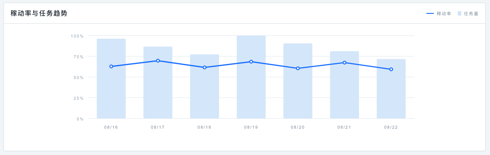
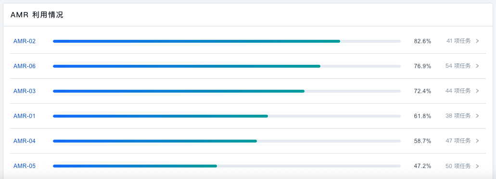
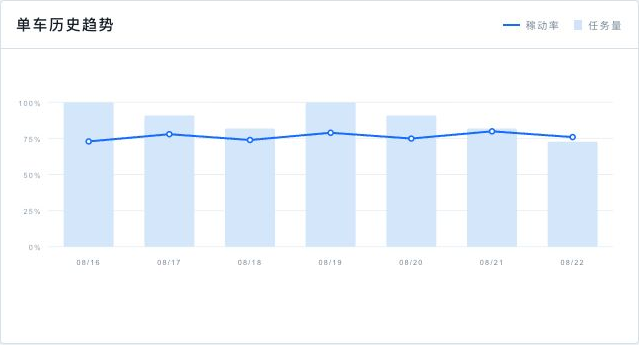
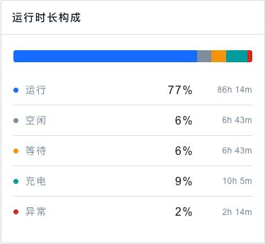
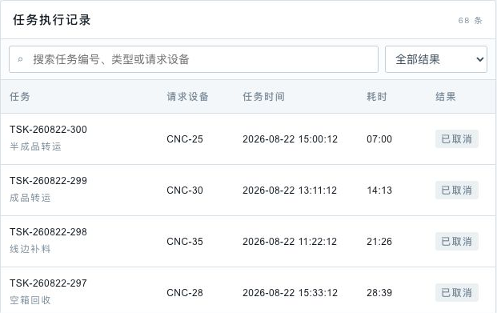
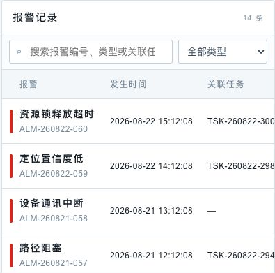

# AMR V1.0.0需求文档

> 即時監控與資料分析功能需求規格  
> 說明性正文使用繁體中文；原型页面名称、字段、按钮、状态及提示文案保留原字。

## 文件資訊

| 欄位 | 內容 |
| --- | --- |
| 文件版本 | V1.0.0 |
| 文件狀態 | 討論稿 |
| 重點範圍 | 实时监控、数据分析 |
| 原型展示 | <https://zhanzhikai611-del.github.io/AMR_V2/> |
| 程式碼倉庫 | <https://github.com/zhanzhikai611-del/AMR_V2> |

## 修訂記錄

| 版本 | 日期 | 修訂內容 | 狀態 |
| --- | --- | --- | --- |
| V1.0.0 | 2026-08-24 | 重整实时监控為「整体页面」與「AMR 详情页」兩個模組，補充點擊 AMR 或資源服務編號標籤觸發同一 AMR 選擇與詳情聯動。 | 討論稿 |

## 1. 文件說明

### 1.1 背景

本系統用於工廠內 AMR 車隊的即時運行監控與歷史資料復盤。本文件說明各頁面的使用情境、資訊呈現、操作流程、狀態聯動及異常處理，作為產品、設計、前端、後端與測試共同開發及整合的依據。

### 1.2 本版範圍

| 模組 | 本版深度 | 說明 |
| --- | --- | --- |
| 实时监控 | 完整 | 分為「实时监控整体页面」與「AMR 详情页」兩個模組；AMR 详情可由 AMR 圖示或 CNC/HOME 左上角的 AMR 编号标签触发。 |
| 数据分析 | 完整 | 页面结构、全局分析、单车分析、记录筛选与分页。 |
| 任务管理 | 標題保留 | 後續版本補充。 |
| 行为树管理 | 標題保留 | 後續版本補充。 |
| 资源管理 | 標題保留 | 後續版本補充。 |
| 地图管理 | 標題保留 | 後續版本補充。 |
| 系统设置 | 標題保留 | 後續版本補充。 |

---

## 2. 实时监控

### 2.1 实时监控整体页面

#### 2.1.1 页面结构与载入

| 需求欄位 | 內容 |
| --- | --- |
| 用户场景 | 值班人員進入系統後，需要在一個頁面內掌握當前運行範圍的整體車輛與地圖狀態。 |
| 功能说明 | 定義「实时监控」的整體頁面結構及載入狀態。 |
| 输入/前置条件 | 使用者已進入「实时监控」頁面。 |
| 输出/后置条件 | 成功載入後進入未選擇車輛的全局態勢；點擊 AMR 或資源服務編號標籤後，在同一頁面開啟對應車輛詳情。 |
| 补充说明 | 車輛可由邏輯地圖上的 AMR 圖示或 CNC/HOME 左上角的车辆编号标签進入詳情，兩種入口共用同一選中狀態。 |

#### 需求描述

图 2-1　实时监控默认页面

页面由以下區域組成：

| 区域 | 显示条件 | 产品说明 |
| --- | --- | --- |
| 顶部车队状态栏 | 頁面資料載入完成後持續顯示 | 展示車隊連線情況、可運行車輛、各狀態數量及當前「运行范围」。 |
| 全局逻辑地图 | 頁面資料載入完成後持續顯示 | 展示共用邏輯路網、CNC、HOME、AMR、服務關係及任務路線。 |
| AMR 详情页（右侧面板） | 點擊 AMR 或服务 AMR 编号标签後顯示 | 由右側開啟，提供「任务执行」與「AMR 信息」兩個子模組。 |
| 展开详情入口 | 已選擇 AMR 且詳情面板被收起 | 顯示所選 AMR 編號與「展开详情」，便於回到同一車輛內容。 |

页面载入规则：

1. 進入頁面後，系統自動讀取當前運行範圍的車隊、地圖、資源與任務資料。
2. 資料讀取期間顯示「正在读取运行态势」，避免以空白地圖造成無資料的誤判。
3. 資料讀取失敗時顯示失敗原因與「重新加载」；使用者可在原頁面重新取得資料。
4. 資料讀取成功後，預設顯示未選擇車輛的全局態勢；使用者點擊 AMR 或服務車輛編號標籤後，再開啟同一車輛詳情。

#### 2.1.2 顶部车队状态栏

| 需求欄位 | 內容 |
| --- | --- |
| 用户场景 | 值班人員需要持續查看車隊連線能力和當前運行狀態分布。 |
| 功能说明 | 在地圖上方持續顯示 AMR 上線、可運行及各運行狀態數量。 |
| 输入/前置条件 | 監控資料已成功載入。 |
| 输出/后置条件 | 狀態列隨車輛連線、運行狀態或接單狀態變化而同步更新。 |
| 补充说明 | 無。 |

#### 需求描述

字段與統計口徑：

| 页面字段 | 统计口径 | 显示规则 |
| --- | --- | --- |
| 上线 | 目前已連線的 AMR | 顯示「已上线数量 / 当前范围 AMR 总数」。 |
| 运行 | 正在執行任務的 AMR | 藍色狀態點與數量。 |
| 空闲 | 已上線且目前無執行任務的 AMR | 綠色狀態點與數量。 |
| 异常 | 發生安全、行駛、任務或設備對接故障的 AMR | 紅色狀態點與數量。 |
| 充电 | 處於充電狀態的 AMR | 紫色狀態點與數量。 |
| 停用 | 正常連線但不參與任務調度的 AMR | 灰色狀態點與數量。 |
| 运行范围 | 目前正在監看的區域 | 顯示當前運行範圍名稱。 |

状态联动：

1. 狀態列須與目前運行範圍內的車輛即時狀態保持一致，車輛上線、離線或狀態改變後同步更新。
2. AMR 狀態固定為运行、空闲、异常、离线、充电、停用六類互斥狀態，不定義等待狀態。
3. 中間狀態區顯示运行、空闲、异常、充电、停用；离线由總數與上线數差額表達。

> **数据一致性**：狀態列、邏輯地圖與車輛詳情應使用同一份即時車輛資料，避免同一輛車在不同區域顯示不同狀態。

#### 2.1.3 全局逻辑地图

| 需求欄位 | 內容 |
| --- | --- |
| 用户场景 | 值班人員需要在未選擇車輛時直接理解全局逻辑地图、車輛位置及 CNC 與 AMR 的服務關係，並在選擇車輛後聚焦其服務資源和任務路線。 |
| 功能说明 | 使用全局共用逻辑地图資料繪製路網、資源、車輛、服務編號及選中任務路線。 |
| 输入/前置条件 | 系統已取得當前運行範圍的邏輯地圖、資源、車輛與任務資料。 |
| 输出/后置条件 | 預設展示全局逻辑地图；點擊 AMR 或資源服務編號標籤後，完成車輛、資源編號、服務範圍、路線和车辆详情页的同步聯動。 |
| 补充说明 | 無。 |

#### 需求描述

图 2-2　全局逻辑地图及 CNC 与 AMR 服务关系

#### 一、地图数据来源

实时监控所使用的地圖為系統全域共用的邏輯地圖，不是單一頁面另行維護的靜態圖片。地图管理與实时监控應引用相同的路網與資源資料，確保地圖版本、資源位置及名稱一致。

| 数据类别 | 业务内容 | 地图用途 |
| --- | --- | --- |
| 路网结构 | 路線、交會點與可通行連線 | 繪製 AMR 可行駛的邏輯路網。 |
| 逻辑资源 | CNC | 顯示資源位置、名稱、方向及其服務車輛編號。 |
| 车辆 | AMR 的位置、朝向、狀態與服務範圍 | 呈現車輛分布及所選車輛的服務關係。 |
| 任务 | AMR 目前執行的任務與路線 | 選擇 AMR 後顯示規劃路徑及已走路徑。 |

#### 二、默认图层和显示顺序

1. 地圖底層顯示定位網格與邏輯路網；拖動地圖時，網格、路網、資源與車輛應整體同步移動。
2. 路網交會點使用圓形節點表示，線段表示 AMR 可行駛的連線。
3. CNC 使用深藍標牌；名稱保持居中，標牌外側使用實心小三角表示方向，每 6 台為一組左右交替。
4. 預設不顯示任務路線；選擇具有任務的 AMR 後，才顯示該車的規劃路徑與已走路徑。
5. AMR 圖示顯示車輛編號後兩位，並以方向箭頭表示目前朝向。

#### 三、CNC 与 AMR 服务关系编号

1. 每台可自動服務的 CNC 上方預設顯示能夠服務該資源的 AMR 編號，不需要先點擊 AMR。
2. CNC-28、CNC-29 為人工上料，不顯示 AMR-05、AMR-06 服務編號；CNC 本體保持正常顯示。
3. 編號取 AMR ID 最後兩位並轉為數字，例如 AMR-01 顯示 1；CNC 上方的「1 2」「3 4」「5 6」分別表示對應的服務車輛。
4. 同一資源可由多輛 AMR 服務時，編號由左至右排列，並保持固定間距，避免互相遮擋。
5. 資源上方只顯示目前可參與調度的 AMR；離線、暂停接单或不具備運行條件的車輛不顯示服務編號。
6. 每個服務編號均為可操作標籤；點擊標籤後選中對應 AMR，並支援鍵盤 Enter／Space 操作。

#### 四、选择 AMR 后的双向联动

1. 使用者可點擊 AMR 圖示，或點擊 CNC/HOME 左上角的车辆编号标签完成選擇；兩種入口均支援鍵盤 Enter／Space。
2. 點擊服務編號標籤時，標籤編號所對應的 AMR 為唯一選中車輛；同一資源存在多個標籤時，以本次點擊的編號為準。
3. 所選 AMR 顯示明顯的選中外框；其他 AMR 降低視覺強度，使操作焦點保持清楚。
4. 屬於該 AMR 服務範圍的 CNC 與 HOME 使用亮色邊框及外發光點亮。
5. 不屬於該 AMR 服務範圍的 CNC 與 HOME 置灰，但仍保留位置與名稱供使用者理解整體地圖。
6. 服務範圍內，所選 AMR 對應的資源上方編號以藍底白字顯示；同一資源上的其他 AMR 編號降低視覺強度。
7. 若所選車輛具有任務，地圖同步顯示該任務路線；無任務時仍可開啟车辆详情页查看車輛資訊。
8. 车辆详情页由右側開啟，地圖自動調整可視區域，確保所選 AMR 不被遮擋。
9. 點擊服務編號標籤不得觸發地圖拖動；兩種入口共用同一車輛與任務選中上下文，不建立第二套選擇狀態。

#### 五、路线与车辆运动

1. 「规划路径 / 已走路径」圖例固定在地圖左上角；未選擇任務時，圖例降低視覺強度。
2. 選擇具有任務的 AMR 後，只顯示該車目前任務的路線，避免多車路線重疊造成判讀困難。
3. 任務執行中時，「已走路径」隨任務進度沿「规划路径」持續增長。
4. 任務已暫停、等待或異常時，保留最後已完成的路段，不再繼續前進。
5. 僅「执行中」且任務正在運行的 AMR 沿路線移動；其他狀態保持最後回報的位置與朝向。

#### 六、地图拖动

1. 使用者在地圖空白區域按住並移動，可平移查看其他區域。
2. 拖動時，網格、路網、資源、AMR 與任務路線需保持相對位置不變。
3. 點擊 AMR、服務編號標籤或路線圖例時不觸發地圖拖動，避免選擇操作與瀏覽操作互相干擾。

#### 七、AMR 在不同状态下的地图表现

| AMR 状态 | 地图表现 | 运动/路线表现 |
| --- | --- | --- |
| 运行 | 藍色車體 | 有運行中任務時沿規劃路徑移動。 |
| 空闲 | 綠色車體 | 保持來源位置，不顯示任務路線。 |
| 充电 | 紫色車體 | 保持來源位置。 |
| 异常 | 紅色車體及擴散警示光 | 保持來源位置；任務可顯示靜態已走路徑。 |
| 停用 | 灰色車體 | 保持來源位置，不參與任務調度。 |

> **开发整合要求**：地圖資料、車輛即時狀態、任務路線及服務範圍須以一致的識別碼關聯；任一資料更新後，相關圖層應在同一次畫面更新中完成聯動。

### 2.2 AMR 详情页

AMR 详情页以实时监控右側面板呈現，不進行頁面跳轉；其選中狀態、服務範圍和任務路線與全局逻辑地图共用同一份上下文。

#### 2.2.1 触发、开合与联动

| 需求欄位 | 內容 |
| --- | --- |
| 用户场景 | 使用者點擊 AMR 或資源服務編號標籤後，需要在不離開地圖的情況下查看對應車輛的任務與車輛資料。 |
| 功能说明 | 定義车辆详情页的觸發、頁簽、收起、展開、關閉及與地圖的雙向聯動。 |
| 输入/前置条件 | 使用者已在全局逻辑地图點擊 AMR，或點擊 CNC/HOME 左上角的车辆编号标签。 |
| 输出/后置条件 | 车辆详情页與地圖共用同一選中上下文，可切換兩個子模組；關閉後清除地圖聯動。 |
| 补充说明 | 無。 |

##### 需求描述

打开条件：

1. 點擊地圖上的 AMR 圖示後，由畫面右側開啟對應车辆详情页。
2. 點擊 CNC/HOME 左上角的车辆编号标签後，選中標籤對應的 AMR，並開啟同一车辆详情页。
3. 同一資源存在多個服務編號時，以本次點擊的編號決定詳情車輛，不自動選擇其他服務車輛。
4. 兩種入口的結果必須一致，包括 AMR 選中外框、其他車輛弱化、服務資源點亮、標籤狀態、任務路線與詳情內容。
5. 面板標題顯示所選 AMR 編號；若由任務情境進入且車輛資料尚未取得，則顯示任務編號。

页签：

1. 面板包含「任务执行」「AMR 信息」兩個頁簽，首次開啟時預設顯示「任务执行」。
2. 若 AMR 資料尚未取得，「AMR 信息」頁簽不可操作，避免顯示不完整資料。

收起、展开与关闭：

1. 點擊「收起 AMR 详情」只收起面板，不清除目前選擇，因此地圖上的車輛選中、服務範圍與任務路線繼續保留。
2. 收起後地圖右上角顯示「AMR 编号 / 展开详情」入口；點擊後重新顯示同一對象詳情。
3. 點擊關閉按鈕後清除車輛與任務選擇，地圖恢復預設全局顯示。

#### 2.2.2 任务执行

| 需求欄位 | 內容 |
| --- | --- |
| 用户场景 | 使用者需要查看所選 AMR 的當前任務、執行進度及行為樹節點狀態。 |
| 功能说明 | 「任务执行」分為任務基本資訊／進度和行為樹節點監控兩個上下區域。 |
| 输入/前置条件 | 已選擇 AMR；該車有任務時，系統已取得對應任務與行為節點資料。 |
| 输出/后置条件 | 使用者在一個頁簽內完成任務概況與節點過程查看；不同車輛狀態使用同一結構呈現。 |
| 补充说明 | 無。 |

##### 需求描述

图 2-3　任务执行—有运行中任务

##### 一、上半部：任务基本信息和进度

| 页面字段 | 显示内容 | 无值显示 |
| --- | --- | --- |
| 当前任务 | 目前關聯的任務編號 | 暂无任务 |
| 任务状态 | 目前任務狀態；無任務時顯示車輛狀態 | 车辆当前状态 |
| 任务类型 | 任務業務類型 | — |
| 请求设备 | 發起服務的設備 | — |
| 任务进度 | 目前任務完成百分比 | 0% |

任务进度同時以數字和橫向進度條顯示；任務進度更新後，兩處內容須保持一致。

##### 二、下半部：行为树节点监控

1. 「执行过程」右側顯示節點總數。
2. 節點依實際執行順序由上至下排列，透過圓點與連接線表達先後關係。
3. 已完成節點顯示節點名稱、狀態與耗時；運行中節點不顯示耗時或過程細節；異常節點保留失敗原因。

| 节点状态 | 页面文案 | 视觉表现 |
| --- | --- | --- |
| 執行中 | 运行中 | 藍色節點及外圈。 |
| 執行成功 | 已完成 | 綠色節點。 |
| 執行失敗 | 失败 | 紅色節點；失敗說明使用淺紅底。 |
| 尚未執行 | 未开始 | 白底灰色邊框。 |

> **信息完整性**：任務狀態、進度、目前節點與節點結果應使用同一任務執行資料，避免出現進度已完成但節點仍顯示執行中的情況。

##### 三、同一模块内的任务状态差异

图 2-4　任务执行—异常任务与失败节点

图 2-5　任务执行—车辆暂无任务

| 车辆/任务情况 | 任务基本信息 | 行为节点区域 |
| --- | --- | --- |
| 运行中任务 | 顯示任務字段與動態進度 | 顯示成功、運行中及未開始節點。 |
| 异常任务 | 任务状态顯示「异常」 | 失敗節點顯示紅色及失敗原因。 |
| 无任务 | 「暂无任务」、字段為「—」、進度 0% | 顯示「0 个节点」，列表為空。 |

#### 2.2.3 AMR 信息

| 需求欄位 | 內容 |
| --- | --- |
| 用户场景 | 使用者需要查看 AMR 基本信息、即時資料與服務範圍。 |
| 功能说明 | 「AMR 信息」包含基本信息、即時信息和只讀服務範圍。 |
| 输入/前置条件 | 已選擇 AMR 並切換到「AMR 信息」。 |
| 输出/后置条件 | AMR 資料與服務範圍持續顯示。 |
| 补充说明 | 本頁不提供服務範圍編輯或暂停接单操作。 |

##### 需求描述

图 2-6　AMR 信息、实时信息与服务范围

##### 一、车辆基本信息

| 页面内容 | 显示规则 |
| --- | --- |
| 车辆标识 | 車輛圖形顯示 AMR 編號後兩位，旁邊顯示車輛名稱。 |
| 型号与底盘 | 以「型號 · 底盤」格式顯示。 |
| 额定载荷 | 顯示車輛額定載荷及單位。 |

##### 二、车辆实时信息

1. 「当前电量」顯示百分比與進度條；低電量與嚴重低電量使用不同程度的警示色。
2. 「当前位置」以座標格式顯示，X、Y 均保留兩位小數。
3. 「当前速度」顯示即時速度與 m/s 單位。

##### 三、服务范围

1. 進入「AMR 信息」或切換 AMR 時，載入該 AMR 的只讀服務範圍。
2. 不再定義 HOME 或服務站點，服務數量只計 CNC。
3. AMR-05、AMR-06 顯示 CNC-25 至 CNC-36 共 12 項完整標定範圍；CNC-28、CNC-29 因人工上料而置灰，實際自動服務為 10 項。
4. 置灰 CNC 不在 `serviceDevices` 中，因此地圖不顯示 AMR 服務編號；完整展示範圍由 `maxServiceDevices` 提供。

> **开发整合要求**：接單狀態以調度服務回傳結果為準；操作成功後同步刷新车辆详情、顶部车队状态栏與全局逻辑地图。

---

## 3. 数据分析

### 3.1 页面结构、统计范围与基础口径

| 需求字段 | 内容 |
| --- | --- |
| 用户场景 | 管理者进入“数据分析”后，需要在统一统计口径下切换全局分析、单车分析和统计周期。 |
| 功能说明 | 定义页面层级、统计周期、运行范围继承、数据来源、计算顺序和异常数据处理规则。 |
| 输入/前置条件 | 用户已进入“数据分析”，系统已取得当前运行范围、AMR 清单、状态流水、任务和报警数据。 |
| 输出/后置条件 | 默认显示近 7 天全局分析；切换页签、周期或分析 AMR 后，所有看板使用同一范围重新计算。 |
| 补充说明 | 数据分析不在页面内重复选择运行范围，直接继承实时监控使用的全局运行范围。 |

#### 页面与统计周期

图 3-1　数据分析整体页面

1. 标题区显示“OPERATION ANALYTICS”和“数据分析”。
2. 页面包含互斥页签“全局分析”“单车分析”，首次进入默认显示“全局分析”。
3. “统计周期”提供“今日”“近 7 天”“近 30 天”，默认“近 7 天”。
4. “今日”为本地时区当日 `00:00:00` 至查询时点；“近 7 天”为当日及前 6 个自然日；“近 30 天”为当日及前 29 个自然日。查询区间统一使用左闭右开 `[startTime, endTime)`。
5. 今日趋势按小时聚合；近 7 天和近 30 天按自然日聚合。所有时间以系统配置时区计算，首期固定为 `Asia/Shanghai`。
6. 所有分析继承当前全局运行范围 `scopeId`。AMR 在周期中途进入或离开该范围时，只统计其实际属于该范围的时间片段。
7. 读取期间显示“正在汇总运行数据”；读取失败时显示失败原因和“重新加载”。接口同时返回 `updatedAt` 和 `metricVersion`，用于确认数据新鲜度与计算版本。

#### 数据来源

| 数据域 | 最小必要字段 | 用途 |
| --- | --- | --- |
| AMR 状态流水 | `amrId`、`scopeId`、`state`、`startedAt`、`endedAt`、心跳有效标识、接单状态 | 计算有效统计时长、运行状态时长和稼动率。 |
| 任务实例 | `taskId`、`requestDeviceId`、`amrId`、`createdAt`、`startedAt`、`endedAt/canceledAt`、`result` | 计算任务量、完成率、趋势与单车任务记录。 |
| 报警事件 | `alarmId`、`amrId`、`alarmType`、`occurredAt`、`recoveredAt/processedAt`、`taskId` | 计算报警数量、异常时长、类型聚合与单车报警记录。 |
| 运行计划与范围关系 | `scopeId`、AMR 有效归属区间、计划运行时段 | 截断查询周期并排除不应纳入分母的时间。 |

#### 通用计算顺序

1. 先按 `scopeId` 和查询区间过滤数据，再将所有跨越周期边界的状态、任务和报警区间裁切到查询区间。
2. 任务按唯一 `taskId` 去重，报警按唯一 `alarmId` 去重；重复上报不能增加数量。
3. 同一 AMR 同一时刻只能归入运行、空闲、异常、离线、充电、停用中的一个状态；状态源冲突时以异常优先，并记录数据质量告警。
4. 先使用秒级原始值计算，再在展示层四舍五入：百分比保留 1 位小数，数量显示整数，时长显示为 `xh ym`；百分比相加产生的尾差归入时长最大的状态，使页面合计为 100%。
5. 分母为 0 时显示“—”，不得显示具有误导性的 `0%`。未恢复报警统计至查询结束时点，并在原始数据中保留未恢复标识。

### 3.2 全局分析

| 需求字段 | 内容 |
| --- | --- |
| 用户场景 | 用户需要了解所选周期内整个运行范围的 AMR 效率、任务产出、状态结构和异常分布。 |
| 功能说明 | 展示全局核心指标、稼动率与任务趋势、状态时长占比、单车稼动率排行和报警类型聚合。 |
| 输入/前置条件 | 当前运行范围和统计周期的数据已完成清洗、去重和状态切片。 |
| 输出/后置条件 | 用户可从全局发现低稼动率或高异常 AMR，并进入对应单车分析。 |
| 补充说明 | 所有全局模块必须由同一份聚合快照生成，避免卡片、趋势和排行之间数值不一致。 |

#### 3.2.1 顶部核心指标看板

图 3-2　全局分析顶部核心指标

| 页面字段 | 业务含义与计算公式 | 统计边界 |
| --- | --- | --- |
| 全局 AMR 稼动率 | `所有 AMR 运行时长之和 ÷ 所有 AMR 有效统计时长之和 × 100%`。必须按时长加权，不得对各车稼动率做简单平均。 | “运行”指任务实际执行状态；AMR 无心跳、离线或暂停接单的时间不进入分母。 |
| 任务量 | `已完成任务数 + 已取消任务数`，按任务结束时间落入统计周期计数。 | 当前仍在待调度、执行中或异常处理中且未结束的任务不计入历史任务量；跨周期任务只在结束所在周期计 1 次。 |
| 任务完成率 | `已完成任务数 ÷（已完成任务数 + 已取消任务数）× 100%`。 | 分母为 0 时显示“—”；异常任务最终处理为完成或取消后，按最终结果计数。 |
| 报警 / 异常 | 统计周期内 `occurredAt` 落入区间的唯一报警事件数，按 `alarmId` 去重。 | 同一报警的多次状态上报只计 1 次；一个任务可关联多条报警，各自计数。 |
| 统计 AMR | 周期内在当前范围至少存在 1 秒有效统计时长的唯一 `amrId` 数量。 | 仅在线但全周期暂停接单、无有效心跳或不属于当前范围的 AMR 不计入。 |

#### 3.2.2 稼动率与任务趋势

图 3-3　全局稼动率与任务趋势

1. 折线表示每个时间桶的加权稼动率：`桶内全部 AMR 运行时长之和 ÷ 桶内全部 AMR 有效统计时长之和 × 100%`。
2. 柱形表示每个时间桶结束的任务数量，即该桶内已完成与已取消任务数之和；任务按结束时间归桶。
3. 折线使用左侧 `0%—100%` 比例轴；柱形使用独立任务数量尺度，柱高不得直接与百分比高度比较。悬浮数据应返回桶起止时间、稼动率、任务量和完成量。
4. 今日按小时显示，近 7 天与近 30 天按日显示；不存在有效统计时长的桶显示为缺失，不得补成 `0%`。
5. 顶部“全局 AMR 稼动率”由全周期总时长重新计算，不等于趋势点百分比的简单平均；全周期任务量应等于所有趋势柱任务量之和。

#### 3.2.3 状态时长占比

图 3-4　全局状态时长占比

| 状态 | 状态区间定义 |
| --- | --- |
| 运行 | AMR 已分配任务且处于实际执行区间，包括导航、取放、对接等执行节点。 |
| 空闲 | AMR 在线且没有活动任务、异常或充电行为。 |
| 充电 | AMR 处于充电状态，以充电状态上报或充电会话区间为准。 |
| 异常 | AMR 因故障或阻断性报警不能正常执行；与其他状态重叠时优先归入异常。 |
| 停用 | AMR 正常连线但不参与任务调度。 |
| 离线 | 系统无法与 AMR 正常通讯或无法取得即时状态。 |

每类状态的绝对时长为所有统计 AMR 对应状态区间的秒数之和；占比公式为 `该状态时长 ÷ 全部状态有效时长之和 × 100%`。运行、空闲、异常、离线、充电、停用六类状态互斥且合计 100%。

#### 3.2.4 AMR 利用情况

图 3-5　AMR 利用情况

“AMR 利用情况”本质上是**单车稼动率排行**，不是另一套“利用率”指标。每一行的百分比使用与单车分析顶部“单车稼动率”完全相同的公式：`该 AMR 运行时长 ÷ 该 AMR 有效统计时长 × 100%`。

1. 默认按稼动率从高到低排序；相同时依次按运行时长、任务量从高到低排序，再按 AMR 编号升序稳定排序。
2. 进度条和百分比表达单车稼动率，右侧任务数量表示该 AMR 在周期内结束的任务数，仅用于辅助判断“高稼动率是否来自足够任务量”。
3. 不同 AMR 的有效统计时长可能不同，因此排行使用百分比比较，同时保留单车页面中的绝对状态时长供进一步判断。
4. 点击任一 AMR 行后切换到“单车分析”，保持原统计周期并加载该 AMR；全局行百分比必须等于单车顶部稼动率。

#### 3.2.5 报警与异常统计

图 3-6　报警与异常统计

1. 按标准化后的 `alarmType` 聚合；同义报警码须先由数据字典映射到统一类型，再进行统计。
2. 类型数量为该类型唯一 `alarmId` 的数量。排序依次按数量降序、影响时长降序、类型名称升序。
3. 类型影响时长为每条报警 `[occurredAt, recoveredAt/processedAt)` 与查询周期交集时长之和；未恢复报警计算至查询结束时点。
4. 同一报警的重复上报必须合并。不同类型报警可能同时发生，因此各类型影响时长之和可能大于全局“异常状态时长”，不可将两者直接相加比较。
5. 全局异常状态时长按 AMR 合并重叠区间后计算；类型影响时长用于识别主要报警来源，两者服务于不同分析目的。

### 3.3 单车分析

| 需求字段 | 内容 |
| --- | --- |
| 用户场景 | 用户从单车页签或全局稼动率排行进入，查看指定 AMR 的效率、状态构成、任务和报警历史。 |
| 功能说明 | 展示 AMR 选择、身份、单车核心指标、趋势、状态时长和两类明细记录。 |
| 输入/前置条件 | 当前运行范围中存在可统计 AMR，且已选择一个 `amrId`。 |
| 输出/后置条件 | 切换 AMR 或周期后加载对应聚合数据，任务和报警页码重置为第 1 页。 |
| 补充说明 | 单车指标必须能与全局对应 AMR 行、全局趋势和全局总量进行反向核对。 |

#### 3.3.1 AMR 选择与身份

图 3-7　单车分析 AMR 选择与身份

1. 下拉选项显示当前运行范围内周期内具有有效统计数据的 AMR，格式为“AMR 编号 · AMR 名称”。
2. 右侧显示 AMR 名称与型号，避免仅凭编号误判分析对象。
3. 从全局“AMR 利用情况”进入时自动选中对应 AMR，并保持统计周期不变。
4. 切换 AMR 时取消或忽略上一请求的过期结果，禁止短暂显示上一台 AMR 的指标或记录。

#### 3.3.2 单车核心指标看板

图 3-8　单车分析顶部核心指标

| 页面字段 | 计算公式 | 与全局关系 |
| --- | --- | --- |
| 单车稼动率 | `该 AMR 运行时长 ÷ 该 AMR 有效统计时长 × 100%`。 | 必须等于全局“AMR 利用情况”中该 AMR 的百分比。 |
| 任务量 | 该 AMR 在周期内结束的已完成与已取消任务数之和。 | 所有 AMR 任务量按 `taskId` 去重求和后等于全局任务量。 |
| 任务完成率 | `该 AMR 已完成任务数 ÷ 该 AMR 已结束任务数 × 100%`。 | 分母为 0 显示“—”；不把仍在执行的任务算作失败。 |
| 报警 / 异常 | 该 AMR 周期内发生的唯一报警事件数。 | 所有 AMR 报警数按 `alarmId` 去重求和后等于全局报警数量。 |

#### 3.3.3 单车历史趋势

图 3-9　单车历史趋势

1. 折线为单个 AMR 在各时间桶内的稼动率：`桶内运行时长 ÷ 桶内有效统计时长 × 100%`。
2. 柱形为该 AMR 在各时间桶结束的任务数；跨桶任务只在结束所在桶计数。
3. 时间粒度、空桶规则和百分比精度与全局趋势一致。全周期单车稼动率由总时长计算，不对趋势点做简单平均。
4. 单车趋势用于识别持续低效、某日任务突增或任务量相近但稼动率异常升高等情况。

#### 3.3.4 运行时长构成

图 3-10　单车运行时长构成

1. 使用与全局状态时长相同的五类状态、冲突优先级和有效时长定义，仅过滤到当前 `amrId`。
2. 每项同时显示绝对时长和占比：`单车该状态时长 ÷ 单车有效统计时长 × 100%`。
3. 单车五类绝对时长之和等于该 AMR 有效统计时长；其中“运行”绝对时长是单车稼动率公式的分子。
4. 若空闲占比高但任务量低，表示需求不足或调度分配偏少；等待占比高需进一步结合资源锁、设备握手和交通阻塞报警判断；异常占比高需查看报警记录。

#### 3.3.5 任务执行记录

图 3-11　单车任务执行记录

1. 记录范围与顶部任务量一致，仅展示周期内已经结束且执行 AMR 为当前 `amrId` 的任务；默认按任务结束时间倒序排列。
2. “任务”显示任务编号和任务类型；“请求设备”显示发起任务请求的设备，不使用起点／终点概念。
3. “任务时间”显示 `startedAt`；“耗时”为 `endedAt/canceledAt - startedAt` 的自然经过时长；“结果”仅显示“已完成”或“已取消”。
4. 关键词匹配任务编号、任务类型或请求设备；结果筛选提供“全部结果”“已完成”“已取消”。每页 10 条，筛选变化后回到第 1 页。
5. 任务按唯一 `taskId` 计数；接口返回的 `total` 必须与顶部任务量在未筛选条件下一致。

#### 3.3.6 报警记录

图 3-12　单车报警记录

1. 记录范围与单车顶部报警数量一致，展示周期内 `occurredAt` 落入区间的唯一报警事件，默认按发生时间倒序排列。
2. 字段仅保留“报警”“发生时间”“关联任务”；“报警”内显示报警类型和报警编号，无关联任务时显示“—”。
3. 列表不展示恢复时间、持续时长和处理结果，但后端仍需返回这些字段供全局状态时长和报警影响时长计算。
4. 关键词匹配报警编号、报警类型或关联任务；类型筛选项由当前 AMR 在周期内实际出现的报警类型生成。每页 10 条，筛选变化后回到第 1 页。
5. 点击关联任务的扩展交互可在后续版本跳转任务详情，首期只展示关联关系。

### 3.4 数据一致性、筛选与分页规则

| 规则类别 | 规则 |
| --- | --- |
| 数量核对 | 全局任务量 = 各 AMR 已结束任务按 `taskId` 去重后的数量；全局报警数 = 各 AMR 报警按 `alarmId` 去重后的数量。 |
| 时长核对 | 单车五类状态时长之和 = 单车有效统计时长；全局五类状态时长之和 = 所有 AMR 有效统计时长之和。 |
| 比率核对 | 全局稼动率使用全局总时长加权计算；单车稼动率与全局排行对应行一致；完成率分母均只包含已完成和已取消任务。 |
| 边界截断 | 状态和报警区间与查询周期取交集；跨周期任务按结束时间计数；仍未结束任务不进入历史任务量。 |
| 晚到数据 | `updatedAt` 后补到的任务结果或报警恢复时间允许修正历史指标；同一 `metricVersion` 下重新查询必须可复现。 |
| 数据缺失 | 无有效分母显示“—”；缺少结束时间的报警统计至查询结束；缺少心跳的未知区间不推断为运行。 |

分页共同规则：

1. 任务记录与报警记录分别维护关键词、筛选条件、页码和总数，互不影响；两栏均每页 10 条并保持等高。
2. 页数最少为 1，0 条记录时显示 `1 / 1` 和明确空结果；第 1 页禁用“上一页”，末页禁用“下一页”。
3. 切换 AMR 或统计周期后，两类记录均重置为第 1 页；快速切换时忽略过期响应。
4. 数据量较大时使用后端筛选和分页。接口必须回传 `page`、`pageSize`、`total`、筛选条件和排序字段，页面显示须与接口一致。

> **开发整合要求**：后端应以状态区间、任务事实表和报警事实表作为唯一数据来源，在同一聚合服务中生成顶部指标、趋势、时长、排行和记录总数。前端只负责格式化和展示，不得在不同组件中重复实现互相冲突的核心公式。

---

## 4. 任务管理

### 4.1 任务总览

### 4.2 任务列表与详情

### 4.3 调度策略

## 5. 行为树管理

### 5.1 行为树列表

### 5.2 行为树编辑

## 6. 资源管理

### 6.1 AMR 列表与详情

### 6.2 设备列表与详情

## 7. 地图管理

### 7.1 地图版本

### 7.2 地图编辑器

## 8. 系统设置

### 8.1 用户管理

### 8.2 角色权限

### 8.3 数据字典

### 8.4 操作日志与系统日志

## 9. 参考资料

- 原型展示：<https://zhanzhikai611-del.github.io/AMR_V2/>
- 原型代码仓库：<https://github.com/zhanzhikai611-del/AMR_V2>
- 项目需求说明：`AMR_V2/Doc/需求说明.md`
- 项目技术架构：`AMR_V2/Doc/技术架构.md`
- 格式参考：`FT Cloud V3.17.10需求文档.docx`（僅參考章節組織、表格字段及截圖表達方式）。
