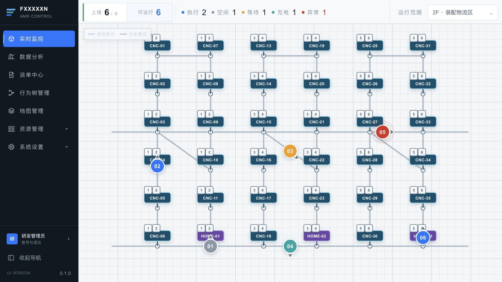
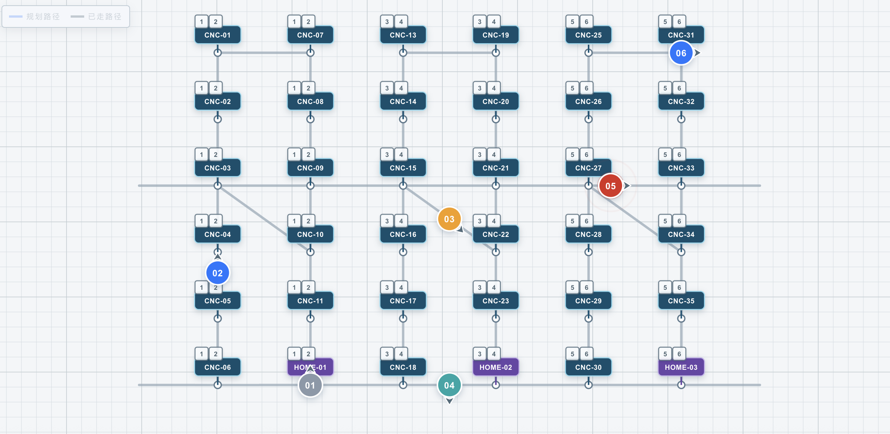
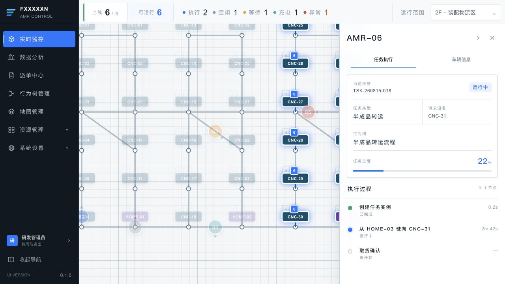
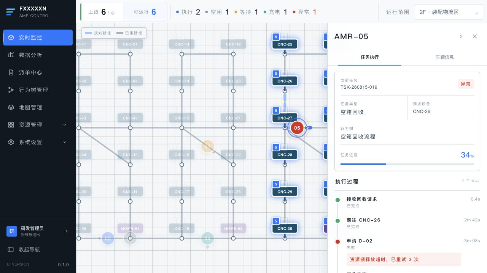
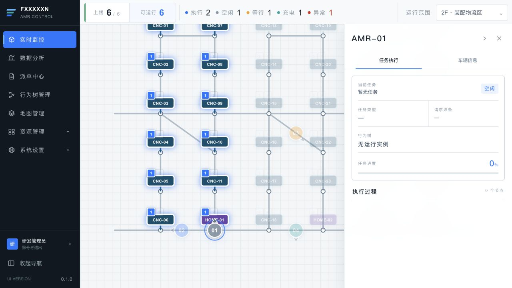
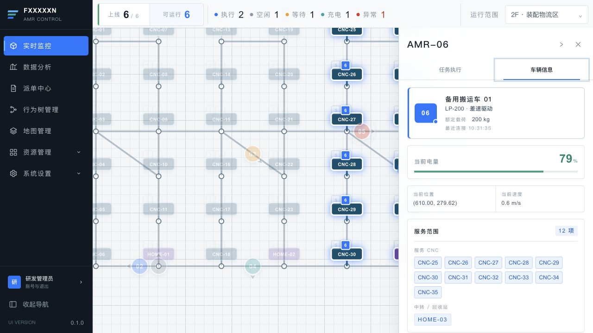
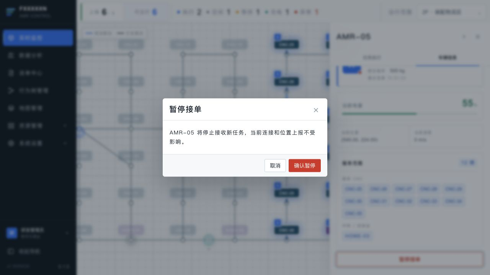
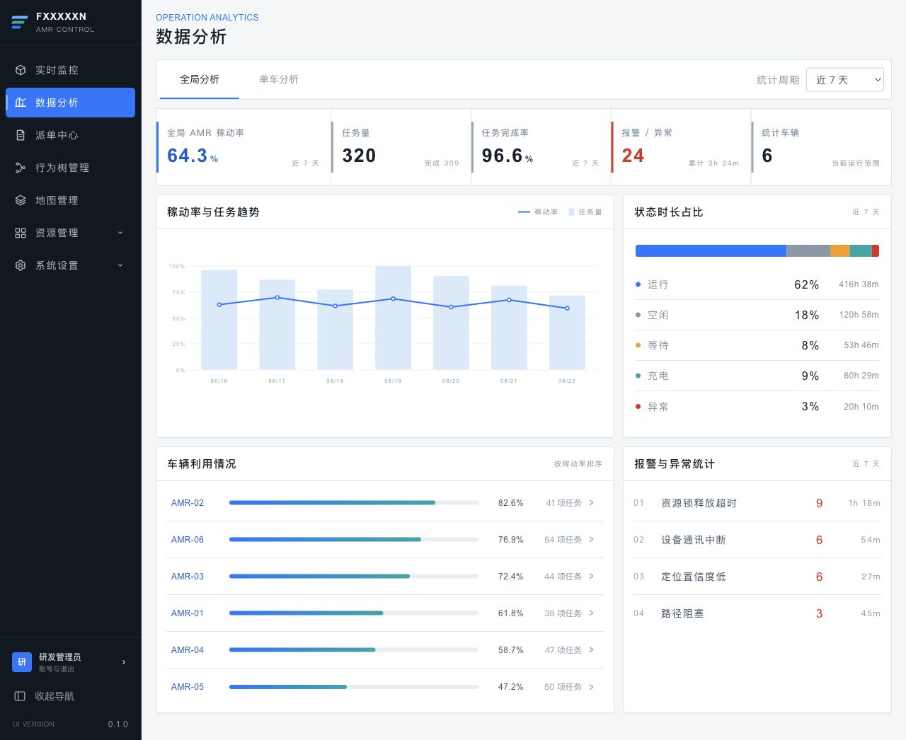
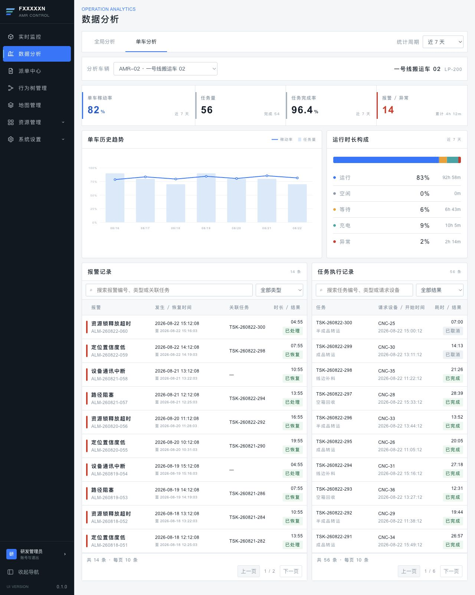
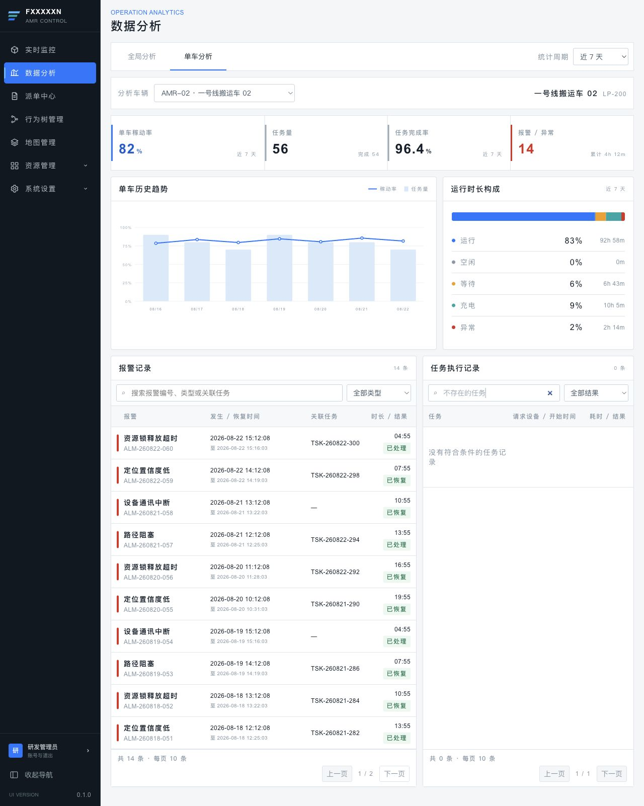

# AMR V1.0.0需求文档

> 即時監控與資料分析功能需求規格  
> 說明性正文使用繁體中文；原型页面名称、字段、按钮、状态及提示文案保留原字。

## 文件資訊

| 欄位 | 內容 |
| --- | --- |
| 文件版本 | V1.0.0 |
| 文件狀態 | 討論稿 |
| 重點範圍 | 实时监控、数据分析 |
| 原型展示 | <https://zhanzhikai611-del.github.io/AMR_V2/> |
| 程式碼倉庫 | <https://github.com/zhanzhikai611-del/AMR_V2> |

## 修訂記錄

| 版本 | 日期 | 修訂內容 | 狀態 |
| --- | --- | --- | --- |
| V1.0.0 | 2026-08-23 | 以產品需求語言整理实时监控與数据分析；所有截圖、操作流程及業務規則納入需求描述。 | 討論稿 |

## 1. 文件說明

### 1.1 背景

本系統用於工廠內 AMR 車隊的即時運行監控與歷史資料復盤。本文件說明各頁面的使用情境、資訊呈現、操作流程、狀態聯動及異常處理，作為產品、設計、前端、後端與測試共同開發及整合的依據。

### 1.2 本版範圍

| 模組 | 本版深度 | 說明 |
| --- | --- | --- |
| 实时监控 | 完整 | 顶部车队状态栏、全局逻辑地图、AMR 选择、车辆详情及其两个子模块。 |
| 数据分析 | 完整 | 页面结构、全局分析、单车分析、记录筛选与分页。 |
| 任务管理 | 標題保留 | 後續版本補充。 |
| 行为树管理 | 標題保留 | 後續版本補充。 |
| 资源管理 | 標題保留 | 後續版本補充。 |
| 地图管理 | 標題保留 | 後續版本補充。 |
| 系统设置 | 標題保留 | 後續版本補充。 |

---

## 2. 实时监控

### 2.1 页面整体结构

| 需求欄位 | 內容 |
| --- | --- |
| 用户场景 | 值班人員進入系統後，需要在一個頁面內掌握當前運行範圍的整體車輛與地圖狀態。 |
| 功能说明 | 定義「实时监控」的整體頁面結構及載入狀態。 |
| 输入/前置条件 | 使用者已進入「实时监控」頁面。 |
| 输出/后置条件 | 成功載入後進入未選擇車輛的全局態勢；選擇車輛後在同一頁面開啟詳情。 |
| 补充说明 | 車輛主要由邏輯地圖上的 AMR 圖示進入詳情，避免額外列表占用地圖空間。 |

#### 需求描述

图 2-1　实时监控默认页面

页面由以下區域組成：

| 区域 | 显示条件 | 产品说明 |
| --- | --- | --- |
| 顶部车队状态栏 | 頁面資料載入完成後持續顯示 | 展示車隊連線情況、可運行車輛、各狀態數量及當前「运行范围」。 |
| 全局逻辑地图 | 頁面資料載入完成後持續顯示 | 展示共用邏輯路網、CNC、HOME、AMR、服務關係及任務路線。 |
| 车辆详情面板 | 選擇 AMR 後顯示 | 由右側開啟，提供「任务执行」與「车辆信息」兩個子模組。 |
| 展开详情入口 | 已選擇 AMR 且詳情面板被收起 | 顯示所選 AMR 編號與「展开详情」，便於回到同一車輛內容。 |

页面载入规则：

1. 進入頁面後，系統自動讀取當前運行範圍的車隊、地圖、資源與任務資料。
2. 資料讀取期間顯示「正在读取运行态势」，避免以空白地圖造成無資料的誤判。
3. 資料讀取失敗時顯示失敗原因與「重新加载」；使用者可在原頁面重新取得資料。
4. 資料讀取成功後，預設顯示未選擇車輛的全局態勢；使用者點擊 AMR 後再開啟詳情。

### 2.2 顶部车队状态栏

| 需求欄位 | 內容 |
| --- | --- |
| 用户场景 | 值班人員需要持續查看車隊連線能力和當前運行狀態分布。 |
| 功能说明 | 在地圖上方持續顯示 AMR 上線、可運行及各運行狀態數量。 |
| 输入/前置条件 | 監控資料已成功載入。 |
| 输出/后置条件 | 狀態列隨車輛連線、運行狀態或接單狀態變化而同步更新。 |
| 补充说明 | 無。 |

#### 需求描述

字段與統計口徑：

| 页面字段 | 统计口径 | 显示规则 |
| --- | --- | --- |
| 上线 | 目前已連線的 AMR | 顯示「已上线数量 / 当前范围 AMR 总数」。 |
| 可运行 | 已連線、未暂停接单且具備運行條件的 AMR | 顯示可參與任務調度與狀態統計的車輛數量。 |
| 执行 | 可運行車輛中正在執行任務的 AMR | 藍色狀態點與數量。 |
| 空闲 | 可運行車輛中目前無執行任務的 AMR | 灰色狀態點與數量。 |
| 等待 | 可運行車輛中正在等待資源或下一步指令的 AMR | 黃色狀態點與數量。 |
| 充电 | 可運行車輛中處於充電狀態的 AMR | 青色狀態點與數量。 |
| 异常 | 可運行車輛中發生故障的 AMR | 紅色狀態點與數量，數字使用紅色強調。 |
| 运行范围 | 目前正在監看的區域 | 顯示當前運行範圍名稱。 |

状态联动：

1. 狀態列須與目前運行範圍內的車輛即時狀態保持一致，車輛上線、離線或狀態改變後同步更新。
2. 車輛執行「暂停接单」後仍屬於已上線車輛，但不再計入「可运行」及後方五類運行狀態。
3. 車輛執行「恢复接单」且具備運行條件後，重新參與「可运行」及對應狀態統計。

> **数据一致性**：狀態列、邏輯地圖與車輛詳情應使用同一份即時車輛資料，避免同一輛車在不同區域顯示不同狀態。

### 2.3 全局逻辑地图

| 需求欄位 | 內容 |
| --- | --- |
| 用户场景 | 值班人員需要在未選擇車輛時直接理解全局逻辑地图、車輛位置及 CNC 與 AMR 的服務關係，並在選擇車輛後聚焦其服務資源和任務路線。 |
| 功能说明 | 使用全局共用逻辑地图資料繪製路網、資源、車輛、服務編號及選中任務路線。 |
| 输入/前置条件 | 系統已取得當前運行範圍的邏輯地圖、資源、車輛與任務資料。 |
| 输出/后置条件 | 預設展示全局逻辑地图；點擊 AMR 後完成車輛、資源編號、服務範圍、路線和詳情面板的同步聯動。 |
| 补充说明 | 無。 |

#### 需求描述

图 2-2　全局逻辑地图及 CNC 与 AMR 服务关系

#### 一、地图数据来源

实时监控所使用的地圖為系統全域共用的邏輯地圖，不是單一頁面另行維護的靜態圖片。地图管理與实时监控應引用相同的路網與資源資料，確保地圖版本、資源位置及名稱一致。

| 数据类别 | 业务内容 | 地图用途 |
| --- | --- | --- |
| 路网结构 | 路線、交會點與可通行連線 | 繪製 AMR 可行駛的邏輯路網。 |
| 逻辑资源 | CNC 與 HOME | 顯示資源位置、名稱及其服務車輛編號。 |
| 车辆 | AMR 的位置、朝向、狀態與服務範圍 | 呈現車輛分布及所選車輛的服務關係。 |
| 任务 | AMR 目前執行的任務與路線 | 選擇 AMR 後顯示規劃路徑及已走路徑。 |

#### 二、默认图层和显示顺序

1. 地圖底層顯示定位網格與邏輯路網；拖動地圖時，網格、路網、資源與車輛應整體同步移動。
2. 路網交會點使用圓形節點表示，線段表示 AMR 可行駛的連線。
3. CNC 使用深藍標牌，HOME 使用紫色標牌，標牌顯示資源名稱。
4. 預設不顯示任務路線；選擇具有任務的 AMR 後，才顯示該車的規劃路徑與已走路徑。
5. AMR 圖示顯示車輛編號後兩位，並以方向箭頭表示目前朝向。

#### 三、CNC 与 AMR 服务关系编号

1. 每台 CNC/HOME 上方預設顯示能夠服務該資源的 AMR 編號，不需要先點擊 AMR。
2. 當 CNC 或 HOME 屬於某輛 AMR 的服務範圍時，在資源上方顯示該 AMR 編號。
3. 編號取 AMR ID 最後兩位並轉為數字，例如 AMR-01 顯示 1；CNC 上方的「1 2」「3 4」「5 6」分別表示對應的服務車輛。
4. 同一資源可由多輛 AMR 服務時，編號由左至右排列，並保持固定間距，避免互相遮擋。
5. 資源上方只顯示目前可參與調度的 AMR；離線、暂停接单或不具備運行條件的車輛不顯示服務編號。

#### 四、点击 AMR 后的地图联动

1. 使用者可點擊 AMR，或使用鍵盤將焦點移至 AMR 後按 Enter 完成選擇。
2. 所選 AMR 顯示明顯的選中外框；其他 AMR 降低視覺強度，使操作焦點保持清楚。
3. 屬於該 AMR 服務範圍的 CNC 與 HOME 使用亮色邊框及外發光點亮。
4. 不屬於該 AMR 服務範圍的 CNC 與 HOME 置灰，但仍保留位置與名稱供使用者理解整體地圖。
5. 服務範圍內，所選 AMR 對應的資源上方編號以藍底白字顯示；同一資源上的其他 AMR 編號降低視覺強度。
6. 若所選車輛具有任務，地圖同步顯示該任務路線，右側開啟车辆详情面板。
7. 開啟詳情面板後，地圖應自動調整可視區域，確保所選 AMR 不被右側面板遮擋。

#### 五、路线与车辆运动

1. 「规划路径 / 已走路径」圖例固定在地圖左上角；未選擇任務時，圖例降低視覺強度。
2. 選擇具有任務的 AMR 後，只顯示該車目前任務的路線，避免多車路線重疊造成判讀困難。
3. 任務執行中時，「已走路径」隨任務進度沿「规划路径」持續增長。
4. 任務已暫停、等待或異常時，保留最後已完成的路段，不再繼續前進。
5. 僅「执行中」且任務正在運行的 AMR 沿路線移動；其他狀態保持最後回報的位置與朝向。

#### 六、地图拖动

1. 使用者在地圖空白區域按住並移動，可平移查看其他區域。
2. 拖動時，網格、路網、資源、AMR 與任務路線需保持相對位置不變。
3. 點擊 AMR 或路線圖例時不觸發地圖拖動，避免選擇操作與瀏覽操作互相干擾。

#### 七、AMR 在不同状态下的地图表现

| AMR 状态 | 地图表现 | 运动/路线表现 |
| --- | --- | --- |
| 执行中 | 藍色車體 | 有運行中任務時沿規劃路徑移動。 |
| 空闲 | 灰色車體 | 保持來源位置，不顯示任務路線。 |
| 等待 | 橙色車體 | 保持來源位置；任務可顯示靜態已走路徑。 |
| 充电 | 青色車體 | 保持來源位置，通常位於 HOME。 |
| 故障 | 紅色車體及擴散警示光 | 保持來源位置；任務可顯示靜態已走路徑。 |
| 暂停接单 | 車體灰階並降低視覺強度 | 不參與新任務調度，位置與目前任務仍持續顯示。 |

> **开发整合要求**：地圖資料、車輛即時狀態、任務路線及服務範圍須以一致的識別碼關聯；任一資料更新後，相關圖層應在同一次畫面更新中完成聯動。

### 2.4 车辆详情面板

#### 2.4.1 面板通用交互

| 需求欄位 | 內容 |
| --- | --- |
| 用户场景 | 使用者點擊地圖車輛後，需要在不離開地圖的情況下查看該車輛的任務與車輛資料。 |
| 功能说明 | 定義右側车辆详情面板的開啟、頁簽、收起、展開和關閉。 |
| 输入/前置条件 | 使用者已在全局逻辑地图選擇 AMR。 |
| 输出/后置条件 | 面板可在同一選中上下文中切換兩個子模組；關閉後清除地圖聯動。 |
| 补充说明 | 無。 |

##### 需求描述

打开条件：

1. 點擊地圖上的 AMR 後，由畫面右側開啟车辆详情面板。
2. 面板標題顯示所選 AMR 編號；若由任務情境進入且車輛資料尚未取得，則顯示任務編號。

页签：

1. 面板包含「任务执行」「车辆信息」兩個頁簽，首次開啟時預設顯示「任务执行」。
2. 若車輛資料尚未取得，「车辆信息」頁簽不可操作，避免顯示不完整資料。

收起、展开与关闭：

1. 點擊「收起 AMR 详情」只收起面板，不清除目前選擇，因此地圖上的車輛選中、服務範圍與任務路線繼續保留。
2. 收起後地圖右上角顯示「AMR 编号 / 展开详情」入口；點擊後重新顯示同一對象詳情。
3. 點擊關閉按鈕後清除車輛與任務選擇，地圖恢復預設全局顯示。

#### 2.4.2 任务执行

| 需求欄位 | 內容 |
| --- | --- |
| 用户场景 | 使用者需要查看所選 AMR 的當前任務、執行進度及行為樹節點狀態。 |
| 功能说明 | 「任务执行」分為任務基本資訊／進度和行為樹節點監控兩個上下區域。 |
| 输入/前置条件 | 已選擇 AMR；該車有任務時，系統已取得對應任務與行為節點資料。 |
| 输出/后置条件 | 使用者在一個頁簽內完成任務概況與節點過程查看；不同車輛狀態使用同一結構呈現。 |
| 补充说明 | 無。 |

##### 需求描述

图 2-3　任务执行—有运行中任务

##### 一、上半部：任务基本信息和进度

| 页面字段 | 显示内容 | 无值显示 |
| --- | --- | --- |
| 当前任务 | 目前關聯的任務編號 | 暂无任务 |
| 任务状态 | 目前任務狀態；無任務時顯示車輛狀態 | 车辆当前状态 |
| 任务类型 | 任務業務類型 | — |
| 请求设备 | 發起或等待服務的設備 | — |
| 行为树 | 目前執行的行為流程名稱 | 无运行实例 |
| 任务进度 | 目前任務完成百分比 | 0% |

任务进度同時以數字和橫向進度條顯示；任務進度更新後，兩處內容須保持一致。

##### 二、下半部：行为树节点监控

1. 「执行过程」右側顯示節點總數。
2. 節點依實際執行順序由上至下排列，透過圓點與連接線表達先後關係。
3. 每個節點顯示節點名稱、狀態與耗時；如有補充資訊，在節點下方顯示等待原因、失敗原因或執行摘要。

| 节点状态 | 页面文案 | 视觉表现 |
| --- | --- | --- |
| 執行中 | 运行中 | 藍色節點及外圈。 |
| 執行成功 | 已完成 | 綠色節點。 |
| 等待條件 | 等待中 | 橙色節點；補充說明使用淺橙底。 |
| 執行失敗 | 失败 | 紅色節點；失敗說明使用淺紅底。 |
| 尚未執行 | 未开始 | 白底灰色邊框。 |

> **信息完整性**：任務狀態、進度、目前節點與節點結果應使用同一任務執行資料，避免出現進度已完成但節點仍顯示執行中的情況。

##### 三、同一模块内的任务状态差异

图 2-4　任务执行—异常任务与失败节点

图 2-5　任务执行—车辆暂无任务

| 车辆/任务情况 | 任务基本信息 | 行为节点区域 |
| --- | --- | --- |
| 运行中任务 | 顯示任務字段與動態進度 | 顯示成功、運行中及未開始節點。 |
| 等待中任务 | 顯示任務字段及當前進度 | 當前節點顯示「等待中」和等待說明。 |
| 异常任务 | 任务状态顯示「异常」 | 失敗節點顯示紅色及失敗原因。 |
| 无任务 | 「暂无任务」、字段為「—」、進度 0% | 顯示「0 个节点」，列表為空。 |

#### 2.4.3 车辆信息

| 需求欄位 | 內容 |
| --- | --- |
| 用户场景 | 使用者需要查看車輛基本信息與即時資料，並調整服務 CNC 和車輛是否接單。 |
| 功能说明 | 「车辆信息」包含基本信息、即時信息、服務範圍編輯和接單狀態控制。 |
| 输入/前置条件 | 已選擇 AMR 並切換到「车辆信息」。 |
| 输出/后置条件 | 車輛資料持續顯示；服務範圍或接單狀態變更成功後，同頁地圖和頂部狀態列立即聯動。 |
| 补充说明 | 服務範圍與接單狀態均須完成後端保存，並提供處理中、成功及失敗反饋。 |

##### 需求描述

图 2-6　车辆信息、实时信息与服务范围

##### 一、车辆基本信息

| 页面内容 | 显示规则 |
| --- | --- |
| 车辆标识 | 車輛圖形顯示 AMR 編號後兩位，旁邊顯示車輛名稱。 |
| 型号与底盘 | 以「型號 · 底盤」格式顯示。 |
| 额定载荷 | 顯示車輛額定載荷及單位。 |
| 最近连接 | 顯示最近一次成功連線時間。 |

##### 二、车辆实时信息

1. 「当前电量」顯示百分比與進度條；低電量與嚴重低電量使用不同程度的警示色。
2. 「当前位置」以座標格式顯示，X、Y 均保留兩位小數。
3. 「当前速度」顯示即時速度與 m/s 單位。

##### 三、编辑服务范围

1. 進入「车辆信息」或切換車輛時，載入該車目前已生效的服務範圍。
2. 「服务范围」數量為服務 CNC 與服務站點的合計數。
3. 「服务 CNC」列出該車可設定的 CNC；目前已服務的 CNC 使用選中樣式。
4. 點擊 CNC 可加入或移出待儲存的服務範圍；只要內容有變更，即顯示「取消」與「保存范围」。
5. 點擊「取消」後放棄尚未儲存的變更，恢復為目前已生效的服務範圍。
6. 點擊「保存范围」後提交變更；儲存期間避免重複操作。儲存成功後，以最新結果更新车辆信息及全局逻辑地图。
7. 儲存失敗時保留原服務範圍，顯示失敗原因，使用者可修改後再次提交。
8. 服務範圍更新後，相關 CNC 頂部的 AMR 服務編號及選中資源高亮須同步更新。
9. 「中转 / 回收站」以只讀標籤顯示服務站點，本次不提供編輯。

> **开发整合要求**：服務範圍須由後端保存並回傳最新版本；前端以儲存成功結果更新畫面，避免重新整理後恢復舊資料。

##### 四、暂停接单 / 恢复接单

图 2-7　暂停接单二次确认

1. 車輛目前可接單時，按鈕顯示「暂停接单」；已暂停接单時，按鈕顯示「恢复接单」。
2. 點擊按鈕後先開啟二次確認彈窗，不立即修改車輛狀態。
3. 暫停文案為「AMR-xx 将停止接收新任务，当前连接和位置上报不受影响。」；恢復文案為「AMR-xx 将重新参与任务调度。」。
4. 點擊遮罩空白、右上角關閉或「取消」均只關閉彈窗。
5. 點擊確認後提交接單狀態變更；處理期間避免重複提交，成功後關閉彈窗並更新畫面。
6. 暂停接单成功後，頂部「可运行」與狀態分布立即更新；地圖車輛顯示暂停接单樣式，資源上方不再顯示該 AMR 的可運行服務編號。
7. 恢复接单成功且車輛具備運行條件後，重新參與狀態統計、服務編號顯示與新任務調度。
8. 變更失敗時維持原狀態並顯示失敗原因，避免畫面狀態與調度系統不一致。

> **开发整合要求**：接單狀態以調度服務回傳結果為準；操作成功後同步刷新车辆详情、顶部车队状态栏與全局逻辑地图。

---

## 3. 数据分析

### 3.1 页面结构与统计周期

| 需求欄位 | 內容 |
| --- | --- |
| 用户场景 | 管理者進入「数据分析」後，需要切換全局／單車層級和統計週期。 |
| 功能说明 | 定義数据分析的標題、頁簽、統計週期與整體載入狀態。 |
| 输入/前置条件 | 使用者已進入「数据分析」頁面。 |
| 输出/后置条件 | 預設顯示近 7 天的全局分析；切換頁簽或週期後更新對應內容。 |
| 补充说明 | 無。 |

#### 需求描述

图 3-1　数据分析—全局分析

页面组成與載入規則：

1. 標題區顯示「OPERATION ANALYTICS」和「数据分析」。
2. 页面内包含互斥页签「全局分析」「单车分析」，首次进入时预设显示「全局分析」。
3. 右側「统计周期」提供「今日」「近 7 天」「近 30 天」，預設為「近 7 天」。
4. 進入頁面後同時準備全局分析與預設車輛的單車分析資料，切換頁簽時減少等待。
5. 讀取期間顯示「正在汇总运行数据」；讀取失敗時顯示失敗原因和「重新加载」。
6. 切換統計週期後，全局指標、圖表、車輛排行、單車指標及明細記錄均按照新週期更新。
7. 所有統計內容均基於當前「运行范围」；運行範圍改變後，應重新取得對應範圍的資料。

> **数据口径**：同一統計週期內，全局分析與單車分析須使用一致的時間範圍、時區、車輛範圍及指標版本，避免跨頁簽資料無法對照。

### 3.2 全局分析

| 需求欄位 | 內容 |
| --- | --- |
| 用户场景 | 使用者需要在一個頁面查看當前週期內的全局 AMR 效率、任務、狀態時長和異常分布。 |
| 功能说明 | 展示全局核心指標、趨勢、狀態時長、車輛利用排行和報警聚合。 |
| 输入/前置条件 | 當前運行範圍及所選統計週期的全局分析資料已載入。 |
| 输出/后置条件 | 使用者可查看全局資料，並可由車輛排行進入對應單車分析。 |
| 补充说明 | 無。 |

#### 需求描述

核心指标：

| 页面字段 | 业务定义 | 附加信息 |
| --- | --- | --- |
| 全局 AMR 稼动率 | 統計車輛有效運行時間占可統計時間的比例 | 顯示百分比及當前週期。 |
| 任务量 | 統計週期內建立的任務總數 | 附加顯示完成任務數。 |
| 任务完成率 | 已完成任務數占可統計任務數的比例 | 顯示百分比及當前週期。 |
| 报警 / 异常 | 統計週期內發生的報警與異常次數 | 附加顯示異常累計時長。 |
| 统计车辆 | 納入本次統計的 AMR 數量 | 附加顯示當前運行範圍。 |

图表和列表：

1. 「稼动率与任务趋势」以折線顯示稼動率、柱形顯示任務量；橫軸依統計週期展示對應時間粒度。
2. 「状态时长占比」展示執行、空閒、等待、充電及異常等狀態在統計週期內的時長與占比。
3. 「车辆利用情况」逐車顯示 AMR 編號、稼動率進度條、稼動率與任務數，並按照頁面既定順序排列。
4. 點擊車輛排行中的任一 AMR 後，自動切換至「单车分析」並載入該車資料。
5. 「报警与异常统计」按異常類型顯示次數與影響時長；時長統一換算為小時、分鐘格式。

> **开发整合要求**：指標卡、趨勢圖、狀態占比、車輛排行與異常統計須由同一統計結果生成；後端需同時返回統計範圍與資料更新時間，供頁面明確當前資料口徑。

### 3.3 单车分析

| 需求欄位 | 內容 |
| --- | --- |
| 用户场景 | 使用者從車輛排行或頁簽進入单车分析，查看指定 AMR 的指標、趨勢、任務和報警。 |
| 功能说明 | 展示單車選擇、身份、核心指標、趨勢、狀態時長及兩類記錄。 |
| 输入/前置条件 | 當前運行範圍已載入車輛清單，且使用者已選擇分析車輛。 |
| 输出/后置条件 | 頁面顯示所選車輛的單車分析資料；切換車輛後任務和報警頁碼重置為第 1 頁。 |
| 补充说明 | 無。 |

#### 需求描述

图 3-2　数据分析—单车分析

车辆选择与身份：

1. 「分析车辆」下拉选项显示当前运行范围内可统计的 AMR，格式为「AMR 编号 · 车辆名称」。
2. 切換車輛後，重新載入所選統計週期的單車指標、圖表、任務記錄與報警記錄。
3. 右側身份區顯示車輛名稱與型號，幫助使用者確認當前分析對象。

单车指标与图表：

1. 指標依序顯示「单车稼动率」「任务量」「任务完成率」「报警 / 异常」，統計口徑與全局分析保持一致。
2. 「单车历史趋势」顯示該車在所選週期內的稼動率與任務變化。
3. 「运行时长构成」顯示各車輛狀態的時長與占比。

记录区域布局：

1. 記錄區採用左右雙欄：报警记录位於左側，任务执行记录位於右側；报警记录區域較寬，便於顯示報警資訊。
2. 兩欄分別維護關鍵詞、篩選條件、頁碼和分頁按鈕，互不影響。

> **开发整合要求**：切換車輛或統計週期時，應取消或忽略上一請求的過期結果，避免快速切換後顯示錯誤車輛的資料。

### 3.4 记录筛选与分页

| 需求欄位 | 內容 |
| --- | --- |
| 用户场景 | 使用者需要在单车分析中分別查找任務和報警，並查看空結果和分頁狀態。 |
| 功能说明 | 定義任務記錄與報警記錄的搜尋、篩選、分頁和空結果。 |
| 输入/前置条件 | 所選車輛的任務記錄與報警記錄已載入，並處於「单车分析」。 |
| 输出/后置条件 | 兩類記錄依據各自條件獨立過濾和分頁；條件變化後回到第 1 頁。 |
| 补充说明 | 無。 |

#### 需求描述

图 3-3　记录筛选后的空结果

任务执行记录：

1. 關鍵詞輸入框提示為「搜索任务编号、类型或请求设备」，輸入內容可匹配任務編號、任務類型或請求設備，英文不區分大小寫。
2. 結果篩選提供「全部结果」「已完成」「已取消」。
3. 關鍵詞或結果條件變化後，任務記錄自動返回第 1 頁。
4. 每頁顯示 10 條任務記錄。
5. 記錄顯示任務編號／類型、請求設備／開始時間、耗時／結果。
6. 無結果時顯示「没有符合条件的任务记录」。

报警记录：

1. 關鍵詞輸入框提示為「搜索报警编号、类型或关联任务」，輸入內容可匹配報警編號、報警類型或關聯任務。
2. 報警類型選項根據所選車輛在當前統計週期內出現的類型生成，預設「全部类型」。
3. 關鍵詞或報警類型變化後，報警記錄自動返回第 1 頁。
4. 每頁顯示 10 條報警記錄。
5. 記錄顯示報警類型／編號、發生／恢復時間、關聯任務、時長／結果。
6. 無結果時顯示「没有符合条件的报警记录」。

分页共同规则：

1. 頁數最少為 1，因此 0 條記錄時仍顯示 1 / 1。
2. 第 1 頁禁用「上一页」；當前頁等於總頁數時禁用「下一页」。
3. 切換分析車輛或統計週期後，兩類記錄均重置為第 1 頁。

> **开发整合要求**：篩選與分頁可由前端或後端執行，但接口返回的總筆數、頁碼、篩選條件與頁面顯示必須一致；資料量較大時優先採用後端篩選與分頁。

---

## 4. 任务管理

### 4.1 任务总览

### 4.2 任务列表与详情

### 4.3 调度策略

## 5. 行为树管理

### 5.1 行为树列表

### 5.2 行为树编辑

## 6. 资源管理

### 6.1 AMR 列表与详情

### 6.2 设备列表与详情

## 7. 地图管理

### 7.1 地图版本

### 7.2 地图编辑器

## 8. 系统设置

### 8.1 用户管理

### 8.2 角色权限

### 8.3 数据字典

### 8.4 操作日志与系统日志

## 9. 参考资料

- 原型展示：<https://zhanzhikai611-del.github.io/AMR_V2/>
- 原型代码仓库：<https://github.com/zhanzhikai611-del/AMR_V2>
- 项目需求说明：`AMR_V2/Doc/需求说明.md`
- 项目技术架构：`AMR_V2/Doc/技术架构.md`
- 格式参考：`FT Cloud V3.17.10需求文档.docx`（僅參考章節組織、表格字段及截圖表達方式）。
