# AMR V1.0.0需求文档

> 即時監控、資料分析、派單中心與地圖管理功能需求規格  
> 說明性正文使用繁體中文；原型页面名称、字段、按钮、状态及提示文案保留原字。

## 文件資訊

| 欄位 | 內容 |
| --- | --- |
| 文件版本 | V1.0.0 |
| 文件狀態 | 討論稿 |
| 重點範圍 | 实时监控、数据分析、派单中心、地图管理 |
| 原型展示 | <https://zhanzhikai611-del.github.io/AMR_V2/> |
| 程式碼倉庫 | <https://github.com/zhanzhikai611-del/AMR_V2> |

## 修訂記錄

| 版本 | 日期 | 修訂內容 | 狀態 |
| --- | --- | --- | --- |
| V1.0.0 | 2026-08-24 | 重整实时监控為「整体页面」與「AMR 详情页」兩個模組，補充點擊 AMR 或資源服務編號標籤觸發同一 AMR 選擇與詳情聯動。 | 討論稿 |
| V1.0.0 | 2026-08-29 | 補充「派单中心」（實時派單、任務設置、派單記錄、調度與隊列規則）與「地图管理」（地圖版本、地圖編輯器）兩個模組的需求描述。 | 討論稿 |

## 1. 文件說明

### 1.1 背景

本系統用於工廠內 AMR 車隊的即時運行監控與歷史資料復盤。本文件說明各頁面的使用情境、資訊呈現、操作流程、狀態聯動及異常處理，作為產品、設計、前端、後端與測試共同開發及整合的依據。

### 1.2 本版範圍

| 模組 | 本版深度 | 說明 |
| --- | --- | --- |
| 实时监控 | 完整 | 分為「实时监控整体页面」與「AMR 详情页」兩個模組；AMR 详情可由 AMR 圖示或 CNC/HOME 左上角的 AMR 编号标签触发。 |
| 数据分析 | 完整 | 页面结构、全局分析、单车分析、记录筛选与分页。 |
| 派单中心 | 完整 | 分為「实时派单」「任务设置」「派单记录」三個頁籤，含任務詳情抽屜、調度選車與隊列規則。 |
| 行为树管理 | 標題保留 | 後續版本補充。 |
| 资源管理 | 標題保留 | 後續版本補充。 |
| 地图管理 | 完整 | 地圖版本（卡片庫、設置當前地圖、導入地圖版本）與地圖編輯器（站點、路線、管制區、草稿與發布）。 |
| 系统设置 | 標題保留 | 後續版本補充。 |

---

## 2. 实时监控

### 2.1 实时监控整体页面

#### 2.1.1 页面结构与载入

| 需求欄位 | 內容 |
| --- | --- |
| 用户场景 | 值班人員進入系統後，需要在一個頁面內掌握當前運行範圍的整體車輛與地圖狀態。 |
| 功能说明 | 定義「实时监控」的整體頁面結構及載入狀態。 |
| 输入/前置条件 | 使用者已進入「实时监控」頁面。 |
| 输出/后置条件 | 成功載入後進入未選擇車輛的全局態勢；點擊 AMR 或資源服務編號標籤後，在同一頁面開啟對應車輛詳情。 |
| 补充说明 | 車輛可由邏輯地圖上的 AMR 圖示或 CNC/HOME 左上角的车辆编号标签進入詳情，兩種入口共用同一選中狀態。 |

#### 需求描述

图 2-1　实时监控默认页面

页面由以下區域組成：

| 区域 | 显示条件 | 产品说明 |
| --- | --- | --- |
| 顶部车队状态栏 | 頁面資料載入完成後持續顯示 | 展示車隊連線情況、可運行車輛、各狀態數量及當前「运行范围」。 |
| 全局逻辑地图 | 頁面資料載入完成後持續顯示 | 展示共用邏輯路網、CNC、HOME、AMR、服務關係及任務路線。 |
| AMR 详情页（右侧面板） | 點擊 AMR 或服务 AMR 编号标签後顯示 | 由右側開啟，提供「任务执行」與「AMR 信息」兩個子模組。 |
| 展开详情入口 | 已選擇 AMR 且詳情面板被收起 | 顯示所選 AMR 編號與「展开详情」，便於回到同一車輛內容。 |

页面载入规则：

1. 進入頁面後，系統自動讀取當前運行範圍的車隊、地圖、資源與任務資料。
2. 資料讀取期間顯示「正在读取运行态势」，避免以空白地圖造成無資料的誤判。
3. 資料讀取失敗時顯示失敗原因與「重新加载」；使用者可在原頁面重新取得資料。
4. 資料讀取成功後，預設顯示未選擇車輛的全局態勢；使用者點擊 AMR 或服務車輛編號標籤後，再開啟同一車輛詳情。

#### 2.1.2 顶部车队状态栏

| 需求欄位 | 內容 |
| --- | --- |
| 用户场景 | 值班人員需要持續查看車隊連線能力和當前運行狀態分布。 |
| 功能说明 | 在地圖上方持續顯示 AMR 上線、可運行及各運行狀態數量。 |
| 输入/前置条件 | 監控資料已成功載入。 |
| 输出/后置条件 | 狀態列隨車輛連線、運行狀態或接單狀態變化而同步更新。 |
| 补充说明 | 無。 |

#### 需求描述

字段與統計口徑：

| 页面字段 | 统计口径 | 显示规则 |
| --- | --- | --- |
| 上线 | 目前已連線的 AMR | 顯示「已上线数量 / 当前范围 AMR 总数」。 |
| 运行 | 正在執行任務的 AMR | 藍色狀態點與數量。 |
| 空闲 | 已上線且目前無執行任務的 AMR | 綠色狀態點與數量。 |
| 异常 | 發生安全、行駛、任務或設備對接故障的 AMR | 紅色狀態點與數量。 |
| 充电 | 處於充電狀態的 AMR | 紫色狀態點與數量。 |
| 停用 | 正常連線但不參與任務調度的 AMR | 灰色狀態點與數量。 |
| 运行范围 | 目前正在監看的區域 | 顯示當前運行範圍名稱。 |

状态联动：

1. 狀態列須與目前運行範圍內的車輛即時狀態保持一致，車輛上線、離線或狀態改變後同步更新。
2. AMR 狀態固定為运行、空闲、异常、离线、充电、停用六類互斥狀態，不定義等待狀態。
3. 中間狀態區顯示运行、空闲、异常、充电、停用；离线由總數與上线數差額表達。

> **数据一致性**：狀態列、邏輯地圖與車輛詳情應使用同一份即時車輛資料，避免同一輛車在不同區域顯示不同狀態。

#### 2.1.3 全局逻辑地图

| 需求欄位 | 內容 |
| --- | --- |
| 用户场景 | 值班人員需要在未選擇車輛時直接理解全局逻辑地图、車輛位置及 CNC 與 AMR 的服務關係，並在選擇車輛後聚焦其服務資源和任務路線。 |
| 功能说明 | 使用全局共用逻辑地图資料繪製路網、資源、車輛、服務編號及選中任務路線。 |
| 输入/前置条件 | 系統已取得當前運行範圍的邏輯地圖、資源、車輛與任務資料。 |
| 输出/后置条件 | 預設展示全局逻辑地图；點擊 AMR 或資源服務編號標籤後，完成車輛、資源編號、服務範圍、路線和车辆详情页的同步聯動。 |
| 补充说明 | 無。 |

#### 需求描述

图 2-2　全局逻辑地图及 CNC 与 AMR 服务关系

#### 一、地图数据来源

实时监控所使用的地圖為系統全域共用的邏輯地圖，不是單一頁面另行維護的靜態圖片。地图管理與实时监控應引用相同的路網與資源資料，確保地圖版本、資源位置及名稱一致。

| 数据类别 | 业务内容 | 地图用途 |
| --- | --- | --- |
| 路网结构 | 路線、交會點與可通行連線 | 繪製 AMR 可行駛的邏輯路網。 |
| 逻辑资源 | CNC | 顯示資源位置、名稱、方向及其服務車輛編號。 |
| 车辆 | AMR 的位置、朝向、狀態與服務範圍 | 呈現車輛分布及所選車輛的服務關係。 |
| 任务 | AMR 目前執行的任務與路線 | 選擇 AMR 後顯示規劃路徑及已走路徑。 |

#### 二、默认图层和显示顺序

1. 地圖底層顯示定位網格與邏輯路網；拖動地圖時，網格、路網、資源與車輛應整體同步移動。
2. 路網交會點使用圓形節點表示，線段表示 AMR 可行駛的連線。
3. CNC 使用深藍標牌；名稱保持居中，標牌外側使用統一朝上的實心小三角表示方向，箭頭位置每 6 台為一組左右交替。
4. 預設不顯示任務路線；選擇具有任務的 AMR 後，才顯示該車的規劃路徑與已走路徑。
5. AMR 圖示顯示車輛編號後兩位，並以方向箭頭表示目前朝向。

#### 三、CNC 与 AMR 服务关系编号

1. 每台可自動服務的 CNC 上方預設顯示能夠服務該資源的 AMR 編號，不需要先點擊 AMR。
2. CNC-28、CNC-29 為人工上料，不顯示 AMR-05、AMR-06 服務編號；CNC 本體保持正常顯示。
3. 編號取 AMR ID 最後兩位並轉為數字，例如 AMR-01 顯示 1；CNC 上方的「1 2」「3 4」「5 6」分別表示對應的服務車輛。
4. 同一資源可由多輛 AMR 服務時，編號由左至右排列，並保持固定間距，避免互相遮擋。
5. 資源上方只顯示目前可參與調度的 AMR；離線、暂停接单或不具備運行條件的車輛不顯示服務編號。
6. 每個服務編號均為可操作標籤；點擊標籤後選中對應 AMR，並支援鍵盤 Enter／Space 操作。

#### 四、选择 AMR 后的双向联动

1. 使用者可點擊 AMR 圖示，或點擊 CNC/HOME 左上角的车辆编号标签完成選擇；兩種入口均支援鍵盤 Enter／Space。
2. 點擊服務編號標籤時，標籤編號所對應的 AMR 為唯一選中車輛；同一資源存在多個標籤時，以本次點擊的編號為準。
3. 所選 AMR 顯示明顯的選中外框；其他 AMR 降低視覺強度，使操作焦點保持清楚。
4. 屬於該 AMR 服務範圍的 CNC 與 HOME 使用亮色邊框及外發光點亮。
5. 不屬於該 AMR 服務範圍的 CNC 與 HOME 置灰，但仍保留位置與名稱供使用者理解整體地圖。
6. 服務範圍內，所選 AMR 對應的資源上方編號以藍底白字顯示；同一資源上的其他 AMR 編號降低視覺強度。
7. 若所選車輛具有任務，地圖同步顯示該任務路線；無任務時仍可開啟车辆详情页查看車輛資訊。
8. 车辆详情页由右側開啟，地圖自動調整可視區域，確保所選 AMR 不被遮擋。
9. 點擊服務編號標籤不得觸發地圖拖動；兩種入口共用同一車輛與任務選中上下文，不建立第二套選擇狀態。

#### 五、路线与车辆运动

1. 「规划路径 / 已走路径」圖例固定在地圖左上角；未選擇任務時，圖例降低視覺強度。
2. 選擇具有任務的 AMR 後，只顯示該車目前任務的路線，避免多車路線重疊造成判讀困難。
3. 任務執行中時，「已走路径」隨任務進度沿「规划路径」持續增長。
4. 任務已暫停、等待或異常時，保留最後已完成的路段，不再繼續前進。
5. 僅「执行中」且任務正在運行的 AMR 沿路線移動；其他狀態保持最後回報的位置與朝向。

#### 六、地图拖动

1. 使用者在地圖空白區域按住並移動，可平移查看其他區域。
2. 拖動時，網格、路網、資源、AMR 與任務路線需保持相對位置不變。
3. 點擊 AMR、服務編號標籤或路線圖例時不觸發地圖拖動，避免選擇操作與瀏覽操作互相干擾。

#### 七、AMR 在不同状态下的地图表现

| AMR 状态 | 地图表现 | 运动/路线表现 |
| --- | --- | --- |
| 运行 | 藍色車體 | 有運行中任務時沿規劃路徑移動。 |
| 空闲 | 綠色車體 | 保持來源位置，不顯示任務路線。 |
| 充电 | 紫色車體 | 保持來源位置。 |
| 异常 | 紅色車體及擴散警示光 | 保持來源位置；任務可顯示靜態已走路徑。 |
| 停用 | 灰色車體 | 保持來源位置，不參與任務調度。 |

> **开发整合要求**：地圖資料、車輛即時狀態、任務路線及服務範圍須以一致的識別碼關聯；任一資料更新後，相關圖層應在同一次畫面更新中完成聯動。

### 2.2 AMR 详情页

AMR 详情页以实时监控右側面板呈現，不進行頁面跳轉；其選中狀態、服務範圍和任務路線與全局逻辑地图共用同一份上下文。

#### 2.2.1 触发、开合与联动

| 需求欄位 | 內容 |
| --- | --- |
| 用户场景 | 使用者點擊 AMR 或資源服務編號標籤後，需要在不離開地圖的情況下查看對應車輛的任務與車輛資料。 |
| 功能说明 | 定義车辆详情页的觸發、頁簽、收起、展開、關閉及與地圖的雙向聯動。 |
| 输入/前置条件 | 使用者已在全局逻辑地图點擊 AMR，或點擊 CNC/HOME 左上角的车辆编号标签。 |
| 输出/后置条件 | 车辆详情页與地圖共用同一選中上下文，可切換兩個子模組；關閉後清除地圖聯動。 |
| 补充说明 | 無。 |

##### 需求描述

打开条件：

1. 點擊地圖上的 AMR 圖示後，由畫面右側開啟對應车辆详情页。
2. 點擊 CNC/HOME 左上角的车辆编号标签後，選中標籤對應的 AMR，並開啟同一车辆详情页。
3. 同一資源存在多個服務編號時，以本次點擊的編號決定詳情車輛，不自動選擇其他服務車輛。
4. 兩種入口的結果必須一致，包括 AMR 選中外框、其他車輛弱化、服務資源點亮、標籤狀態、任務路線與詳情內容。
5. 面板標題顯示所選 AMR 編號；若由任務情境進入且車輛資料尚未取得，則顯示任務編號。

页签：

1. 面板包含「任务执行」「AMR 信息」兩個頁簽，首次開啟時預設顯示「任务执行」。
2. 若 AMR 資料尚未取得，「AMR 信息」頁簽不可操作，避免顯示不完整資料。

收起、展开与关闭：

1. 點擊「收起 AMR 详情」只收起面板，不清除目前選擇，因此地圖上的車輛選中、服務範圍與任務路線繼續保留。
2. 收起後地圖右上角顯示「AMR 编号 / 展开详情」入口；點擊後重新顯示同一對象詳情。
3. 點擊關閉按鈕後清除車輛與任務選擇，地圖恢復預設全局顯示。

#### 2.2.2 任务执行

| 需求欄位 | 內容 |
| --- | --- |
| 用户场景 | 使用者需要查看所選 AMR 的當前任務、執行進度及行為樹節點狀態。 |
| 功能说明 | 「任务执行」分為任務基本資訊／進度和行為樹節點監控兩個上下區域。 |
| 输入/前置条件 | 已選擇 AMR；該車有任務時，系統已取得對應任務與行為節點資料。 |
| 输出/后置条件 | 使用者在一個頁簽內完成任務概況與節點過程查看；不同車輛狀態使用同一結構呈現。 |
| 补充说明 | 無。 |

##### 需求描述

图 2-3　任务执行—有运行中任务

##### 一、上半部：任务基本信息和进度

| 页面字段 | 显示内容 | 无值显示 |
| --- | --- | --- |
| 当前任务 | 目前關聯的任務編號 | 暂无任务 |
| 任务状态 | 目前任務狀態；無任務時顯示車輛狀態 | 车辆当前状态 |
| 任务类型 | 任務業務類型 | — |
| 请求设备 | 發起服務的設備 | — |
| 任务进度 | 目前任務完成百分比 | 0% |

任务进度同時以數字和橫向進度條顯示；任務進度更新後，兩處內容須保持一致。

##### 二、下半部：行为树节点监控

1. 「执行过程」右側顯示節點總數。
2. 節點依實際執行順序由上至下排列，透過圓點與連接線表達先後關係。
3. 已完成節點顯示節點名稱、狀態與耗時；運行中節點不顯示耗時或過程細節；異常節點保留失敗原因。

| 节点状态 | 页面文案 | 视觉表现 |
| --- | --- | --- |
| 執行中 | 运行中 | 藍色節點及外圈。 |
| 執行成功 | 已完成 | 綠色節點。 |
| 執行失敗 | 失败 | 紅色節點；失敗說明使用淺紅底。 |
| 尚未執行 | 未开始 | 白底灰色邊框。 |

> **信息完整性**：任務狀態、進度、目前節點與節點結果應使用同一任務執行資料，避免出現進度已完成但節點仍顯示執行中的情況。

##### 三、同一模块内的任务状态差异

图 2-4　任务执行—异常任务与失败节点

图 2-5　任务执行—车辆暂无任务

| 车辆/任务情况 | 任务基本信息 | 行为节点区域 |
| --- | --- | --- |
| 运行中任务 | 顯示任務字段與動態進度 | 顯示成功、運行中及未開始節點。 |
| 异常任务 | 任务状态顯示「异常」 | 失敗節點顯示紅色及失敗原因。 |
| 无任务 | 「暂无任务」、字段為「—」、進度 0% | 顯示「0 个节点」，列表為空。 |

#### 2.2.3 AMR 信息

| 需求欄位 | 內容 |
| --- | --- |
| 用户场景 | 使用者需要查看 AMR 基本信息、即時資料與服務範圍。 |
| 功能说明 | 「AMR 信息」包含基本信息、即時信息和只讀服務範圍。 |
| 输入/前置条件 | 已選擇 AMR 並切換到「AMR 信息」。 |
| 输出/后置条件 | AMR 資料與服務範圍持續顯示。 |
| 补充说明 | 本頁不提供服務範圍編輯或暂停接单操作。 |

##### 需求描述

图 2-6　AMR 信息、实时信息与服务范围

##### 一、车辆基本信息

| 页面内容 | 显示规则 |
| --- | --- |
| 车辆标识 | 車輛圖形顯示 AMR 編號後兩位，旁邊顯示車輛名稱。 |
| 型号与底盘 | 以「型號 · 底盤」格式顯示。 |
| 额定载荷 | 顯示車輛額定載荷及單位。 |

##### 二、车辆实时信息

1. 「当前电量」顯示百分比與進度條；低電量與嚴重低電量使用不同程度的警示色。
2. 「当前位置」以座標格式顯示，X、Y 均保留兩位小數。
3. 「当前速度」顯示即時速度與 m/s 單位。

##### 三、服务范围

1. 進入「AMR 信息」或切換 AMR 時，載入該 AMR 的只讀服務範圍。
2. 不再定義 HOME 或服務站點，服務數量只計 CNC。
3. AMR-05、AMR-06 顯示 CNC-25 至 CNC-36 共 12 項完整標定範圍；CNC-28、CNC-29 因人工上料而置灰，實際自動服務為 10 項。
4. 置灰 CNC 不在 `serviceDevices` 中，因此地圖不顯示 AMR 服務編號；完整展示範圍由 `maxServiceDevices` 提供。

> **开发整合要求**：接單狀態以調度服務回傳結果為準；操作成功後同步刷新车辆详情、顶部车队状态栏與全局逻辑地图。

---

## 3. 数据分析

### 3.1 页面结构、统计范围与基础口径

| 需求字段 | 内容 |
| --- | --- |
| 用户场景 | 管理者进入“数据分析”后，需要在统一统计口径下切换全局分析、单车分析和统计周期。 |
| 功能说明 | 定义页面层级、统计周期、运行范围继承、数据来源、计算顺序和异常数据处理规则。 |
| 输入/前置条件 | 用户已进入“数据分析”，系统已取得当前运行范围、AMR 清单、状态流水、任务和报警数据。 |
| 输出/后置条件 | 默认显示近 7 天全局分析；切换页签、周期或分析 AMR 后，所有看板使用同一范围重新计算。 |
| 补充说明 | 数据分析不在页面内重复选择运行范围，直接继承实时监控使用的全局运行范围。 |

#### 页面与统计周期

图 3-1　数据分析整体页面

1. 标题区显示“OPERATION ANALYTICS”和“数据分析”。
2. 页面包含互斥页签“全局分析”“单车分析”，首次进入默认显示“全局分析”。
3. “统计周期”提供“今日”“近 7 天”“近 30 天”，默认“近 7 天”。
4. “今日”为本地时区当日 `00:00:00` 至查询时点；“近 7 天”为当日及前 6 个自然日；“近 30 天”为当日及前 29 个自然日。查询区间统一使用左闭右开 `[startTime, endTime)`。
5. 今日趋势按小时聚合；近 7 天和近 30 天按自然日聚合。所有时间以系统配置时区计算，首期固定为 `Asia/Shanghai`。
6. 所有分析继承当前全局运行范围 `scopeId`。AMR 在周期中途进入或离开该范围时，只统计其实际属于该范围的时间片段。
7. 读取期间显示“正在汇总运行数据”；读取失败时显示失败原因和“重新加载”。接口同时返回 `updatedAt` 和 `metricVersion`，用于确认数据新鲜度与计算版本。

#### 数据来源

| 数据域 | 最小必要字段 | 用途 |
| --- | --- | --- |
| AMR 状态流水 | `amrId`、`scopeId`、`state`、`startedAt`、`endedAt`、心跳有效标识、接单状态 | 计算有效统计时长、运行状态时长和稼动率。 |
| 任务实例 | `taskId`、`requestDeviceId`、`amrId`、`createdAt`、`startedAt`、`endedAt/canceledAt`、`result` | 计算任务量、完成率、趋势与单车任务记录。 |
| 报警事件 | `alarmId`、`amrId`、`alarmType`、`occurredAt`、`recoveredAt/processedAt`、`taskId` | 计算报警数量、异常时长、类型聚合与单车报警记录。 |
| 运行计划与范围关系 | `scopeId`、AMR 有效归属区间、计划运行时段 | 截断查询周期并排除不应纳入分母的时间。 |

#### 通用计算顺序

1. 先按 `scopeId` 和查询区间过滤数据，再将所有跨越周期边界的状态、任务和报警区间裁切到查询区间。
2. 任务按唯一 `taskId` 去重，报警按唯一 `alarmId` 去重；重复上报不能增加数量。
3. 同一 AMR 同一时刻只能归入运行、空闲、异常、离线、充电、停用中的一个状态；状态源冲突时以异常优先，并记录数据质量告警。
4. 先使用秒级原始值计算，再在展示层四舍五入：百分比保留 1 位小数，数量显示整数，时长显示为 `xh ym`；百分比相加产生的尾差归入时长最大的状态，使页面合计为 100%。
5. 分母为 0 时显示“—”，不得显示具有误导性的 `0%`。未恢复报警统计至查询结束时点，并在原始数据中保留未恢复标识。

### 3.2 全局分析

| 需求字段 | 内容 |
| --- | --- |
| 用户场景 | 用户需要了解所选周期内整个运行范围的 AMR 效率、任务产出、状态结构和异常分布。 |
| 功能说明 | 展示全局核心指标、稼动率与任务趋势、状态时长占比、单车稼动率排行和报警类型聚合。 |
| 输入/前置条件 | 当前运行范围和统计周期的数据已完成清洗、去重和状态切片。 |
| 输出/后置条件 | 用户可从全局发现低稼动率或高异常 AMR，并进入对应单车分析。 |
| 补充说明 | 所有全局模块必须由同一份聚合快照生成，避免卡片、趋势和排行之间数值不一致。 |

#### 3.2.1 顶部核心指标看板

图 3-2　全局分析顶部核心指标

| 页面字段 | 业务含义与计算公式 | 统计边界 |
| --- | --- | --- |
| 全局 AMR 稼动率 | `所有 AMR 运行时长之和 ÷ 所有 AMR 有效统计时长之和 × 100%`。必须按时长加权，不得对各车稼动率做简单平均。 | “运行”指任务实际执行状态；AMR 无心跳、离线或暂停接单的时间不进入分母。 |
| 任务量 | `已完成任务数 + 已取消任务数`，按任务结束时间落入统计周期计数。 | 当前仍在待调度、执行中或异常处理中且未结束的任务不计入历史任务量；跨周期任务只在结束所在周期计 1 次。 |
| 任务完成率 | `已完成任务数 ÷（已完成任务数 + 已取消任务数）× 100%`。 | 分母为 0 时显示“—”；异常任务最终处理为完成或取消后，按最终结果计数。 |
| 报警 / 异常 | 统计周期内 `occurredAt` 落入区间的唯一报警事件数，按 `alarmId` 去重。 | 同一报警的多次状态上报只计 1 次；一个任务可关联多条报警，各自计数。 |
| 统计 AMR | 周期内在当前范围至少存在 1 秒有效统计时长的唯一 `amrId` 数量。 | 仅在线但全周期暂停接单、无有效心跳或不属于当前范围的 AMR 不计入。 |

#### 3.2.2 稼动率与任务趋势

图 3-3　全局稼动率与任务趋势

1. 折线表示每个时间桶的加权稼动率：`桶内全部 AMR 运行时长之和 ÷ 桶内全部 AMR 有效统计时长之和 × 100%`。
2. 柱形表示每个时间桶结束的任务数量，即该桶内已完成与已取消任务数之和；任务按结束时间归桶。
3. 折线使用左侧 `0%—100%` 比例轴；柱形使用独立任务数量尺度，柱高不得直接与百分比高度比较。悬浮数据应返回桶起止时间、稼动率、任务量和完成量。
4. 今日按小时显示，近 7 天与近 30 天按日显示；不存在有效统计时长的桶显示为缺失，不得补成 `0%`。
5. 顶部“全局 AMR 稼动率”由全周期总时长重新计算，不等于趋势点百分比的简单平均；全周期任务量应等于所有趋势柱任务量之和。

#### 3.2.3 状态时长占比

图 3-4　全局状态时长占比

| 状态 | 状态区间定义 |
| --- | --- |
| 运行 | AMR 已分配任务且处于实际执行区间，包括导航、取放、对接等执行节点。 |
| 空闲 | AMR 在线且没有活动任务、异常或充电行为。 |
| 充电 | AMR 处于充电状态，以充电状态上报或充电会话区间为准。 |
| 异常 | AMR 因故障或阻断性报警不能正常执行；与其他状态重叠时优先归入异常。 |
| 停用 | AMR 正常连线但不参与任务调度。 |
| 离线 | 系统无法与 AMR 正常通讯或无法取得即时状态。 |

每类状态的绝对时长为所有统计 AMR 对应状态区间的秒数之和；占比公式为 `该状态时长 ÷ 全部状态有效时长之和 × 100%`。运行、空闲、异常、离线、充电、停用六类状态互斥且合计 100%。

#### 3.2.4 AMR 利用情况

图 3-5　AMR 利用情况

“AMR 利用情况”本质上是**单车稼动率排行**，不是另一套“利用率”指标。每一行的百分比使用与单车分析顶部“单车稼动率”完全相同的公式：`该 AMR 运行时长 ÷ 该 AMR 有效统计时长 × 100%`。

1. 默认按稼动率从高到低排序；相同时依次按运行时长、任务量从高到低排序，再按 AMR 编号升序稳定排序。
2. 进度条和百分比表达单车稼动率，右侧任务数量表示该 AMR 在周期内结束的任务数，仅用于辅助判断“高稼动率是否来自足够任务量”。
3. 不同 AMR 的有效统计时长可能不同，因此排行使用百分比比较，同时保留单车页面中的绝对状态时长供进一步判断。
4. 点击任一 AMR 行后切换到“单车分析”，保持原统计周期并加载该 AMR；全局行百分比必须等于单车顶部稼动率。

#### 3.2.5 报警与异常统计

图 3-6　报警与异常统计

1. 按标准化后的 `alarmType` 聚合；同义报警码须先由数据字典映射到统一类型，再进行统计。
2. 类型数量为该类型唯一 `alarmId` 的数量。排序依次按数量降序、影响时长降序、类型名称升序。
3. 类型影响时长为每条报警 `[occurredAt, recoveredAt/processedAt)` 与查询周期交集时长之和；未恢复报警计算至查询结束时点。
4. 同一报警的重复上报必须合并。不同类型报警可能同时发生，因此各类型影响时长之和可能大于全局“异常状态时长”，不可将两者直接相加比较。
5. 全局异常状态时长按 AMR 合并重叠区间后计算；类型影响时长用于识别主要报警来源，两者服务于不同分析目的。

### 3.3 单车分析

| 需求字段 | 内容 |
| --- | --- |
| 用户场景 | 用户从单车页签或全局稼动率排行进入，查看指定 AMR 的效率、状态构成、任务和报警历史。 |
| 功能说明 | 展示 AMR 选择、身份、单车核心指标、趋势、状态时长和两类明细记录。 |
| 输入/前置条件 | 当前运行范围中存在可统计 AMR，且已选择一个 `amrId`。 |
| 输出/后置条件 | 切换 AMR 或周期后加载对应聚合数据，任务和报警页码重置为第 1 页。 |
| 补充说明 | 单车指标必须能与全局对应 AMR 行、全局趋势和全局总量进行反向核对。 |

#### 3.3.1 AMR 选择与身份

图 3-7　单车分析 AMR 选择与身份

1. 下拉选项显示当前运行范围内周期内具有有效统计数据的 AMR，格式为“AMR 编号 · AMR 名称”。
2. 右侧显示 AMR 名称与型号，避免仅凭编号误判分析对象。
3. 从全局“AMR 利用情况”进入时自动选中对应 AMR，并保持统计周期不变。
4. 切换 AMR 时取消或忽略上一请求的过期结果，禁止短暂显示上一台 AMR 的指标或记录。

#### 3.3.2 单车核心指标看板

图 3-8　单车分析顶部核心指标

| 页面字段 | 计算公式 | 与全局关系 |
| --- | --- | --- |
| 单车稼动率 | `该 AMR 运行时长 ÷ 该 AMR 有效统计时长 × 100%`。 | 必须等于全局“AMR 利用情况”中该 AMR 的百分比。 |
| 任务量 | 该 AMR 在周期内结束的已完成与已取消任务数之和。 | 所有 AMR 任务量按 `taskId` 去重求和后等于全局任务量。 |
| 任务完成率 | `该 AMR 已完成任务数 ÷ 该 AMR 已结束任务数 × 100%`。 | 分母为 0 显示“—”；不把仍在执行的任务算作失败。 |
| 报警 / 异常 | 该 AMR 周期内发生的唯一报警事件数。 | 所有 AMR 报警数按 `alarmId` 去重求和后等于全局报警数量。 |

#### 3.3.3 单车历史趋势

图 3-9　单车历史趋势

1. 折线为单个 AMR 在各时间桶内的稼动率：`桶内运行时长 ÷ 桶内有效统计时长 × 100%`。
2. 柱形为该 AMR 在各时间桶结束的任务数；跨桶任务只在结束所在桶计数。
3. 时间粒度、空桶规则和百分比精度与全局趋势一致。全周期单车稼动率由总时长计算，不对趋势点做简单平均。
4. 单车趋势用于识别持续低效、某日任务突增或任务量相近但稼动率异常升高等情况。

#### 3.3.4 运行时长构成

图 3-10　单车运行时长构成

1. 使用与全局状态时长相同的五类状态、冲突优先级和有效时长定义，仅过滤到当前 `amrId`。
2. 每项同时显示绝对时长和占比：`单车该状态时长 ÷ 单车有效统计时长 × 100%`。
3. 单车五类绝对时长之和等于该 AMR 有效统计时长；其中“运行”绝对时长是单车稼动率公式的分子。
4. 若空闲占比高但任务量低，表示需求不足或调度分配偏少；等待占比高需进一步结合资源锁、设备握手和交通阻塞报警判断；异常占比高需查看报警记录。

#### 3.3.5 任务执行记录

图 3-11　单车任务执行记录

1. 记录范围与顶部任务量一致，仅展示周期内已经结束且执行 AMR 为当前 `amrId` 的任务；默认按任务结束时间倒序排列。
2. “任务”显示任务编号和任务类型；“请求设备”显示发起任务请求的设备，不使用起点／终点概念。
3. “任务时间”显示 `startedAt`；“耗时”为 `endedAt/canceledAt - startedAt` 的自然经过时长；“结果”仅显示“已完成”或“已取消”。
4. 关键词匹配任务编号、任务类型或请求设备；结果筛选提供“全部结果”“已完成”“已取消”。每页 10 条，筛选变化后回到第 1 页。
5. 任务按唯一 `taskId` 计数；接口返回的 `total` 必须与顶部任务量在未筛选条件下一致。

#### 3.3.6 报警记录

图 3-12　单车报警记录

1. 记录范围与单车顶部报警数量一致，展示周期内 `occurredAt` 落入区间的唯一报警事件，默认按发生时间倒序排列。
2. 字段仅保留“报警”“发生时间”“关联任务”；“报警”内显示报警类型和报警编号，无关联任务时显示“—”。
3. 列表不展示恢复时间、持续时长和处理结果，但后端仍需返回这些字段供全局状态时长和报警影响时长计算。
4. 关键词匹配报警编号、报警类型或关联任务；类型筛选项由当前 AMR 在周期内实际出现的报警类型生成。每页 10 条，筛选变化后回到第 1 页。
5. 点击关联任务的扩展交互可在后续版本跳转任务详情，首期只展示关联关系。

### 3.4 数据一致性、筛选与分页规则

| 规则类别 | 规则 |
| --- | --- |
| 数量核对 | 全局任务量 = 各 AMR 已结束任务按 `taskId` 去重后的数量；全局报警数 = 各 AMR 报警按 `alarmId` 去重后的数量。 |
| 时长核对 | 单车五类状态时长之和 = 单车有效统计时长；全局五类状态时长之和 = 所有 AMR 有效统计时长之和。 |
| 比率核对 | 全局稼动率使用全局总时长加权计算；单车稼动率与全局排行对应行一致；完成率分母均只包含已完成和已取消任务。 |
| 边界截断 | 状态和报警区间与查询周期取交集；跨周期任务按结束时间计数；仍未结束任务不进入历史任务量。 |
| 晚到数据 | `updatedAt` 后补到的任务结果或报警恢复时间允许修正历史指标；同一 `metricVersion` 下重新查询必须可复现。 |
| 数据缺失 | 无有效分母显示“—”；缺少结束时间的报警统计至查询结束；缺少心跳的未知区间不推断为运行。 |

分页共同规则：

1. 任务记录与报警记录分别维护关键词、筛选条件、页码和总数，互不影响；两栏均每页 10 条并保持等高。
2. 页数最少为 1，0 条记录时显示 `1 / 1` 和明确空结果；第 1 页禁用“上一页”，末页禁用“下一页”。
3. 切换 AMR 或统计周期后，两类记录均重置为第 1 页；快速切换时忽略过期响应。
4. 数据量较大时使用后端筛选和分页。接口必须回传 `page`、`pageSize`、`total`、筛选条件和排序字段，页面显示须与接口一致。

> **开发整合要求**：后端应以状态区间、任务事实表和报警事实表作为唯一数据来源，在同一聚合服务中生成顶部指标、趋势、时长、排行和记录总数。前端只负责格式化和展示，不得在不同组件中重复实现互相冲突的核心公式。

---

## 4. 派单中心

### 4.1 页面结构与数据来源

| 需求字段 | 内容 |
| --- | --- |
| 用户场景 | 调度员与值班人员需要在同一页面内查看当前任务的实时执行情况、调整各类任务的派单策略，并回溯历史派单结果。 |
| 功能说明 | 定义“派单中心”的页签结构、数据来源与实时推进机制，说明实时任务与派单记录之间的流转关系。 |
| 输入/前置条件 | 用户已进入“派单中心”页面；系统已取得运行态势快照（任务、AMR、资源）、历史派单记录与任务设置规则。 |
| 输出/后置条件 | 默认显示“实时派单”；页面按固定节奏推进任务进度，任务结束后自动归档为派单记录；切换页签不丢失已加载的数据。 |
| 补充说明 | 派单中心继承实时监控的当前运行范围，页面内不提供单独的范围切换。 |

#### 页签结构

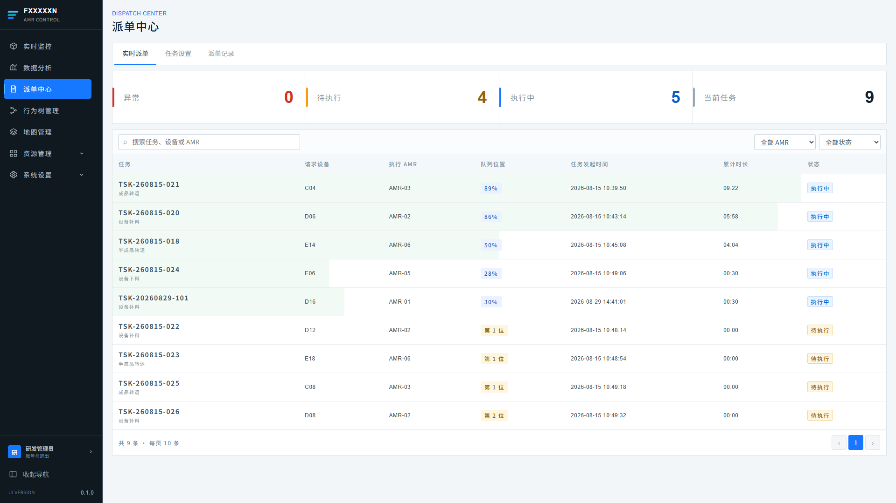

图 4-1　派单中心·实时派单页

1. 标题区显示“DISPATCH CENTER”和“派单中心”。
2. 页面包含互斥页签“实时派单”“任务设置”“派单记录”，首次进入默认显示“实时派单”。
3. 三个页签共用同一份已加载的数据：实时任务、AMR 清单、任务设置规则和历史派单记录；切换页签不重复请求数据。
4. 任务详情以右侧抽屉呈现，在“实时派单”和“派单记录”页签均可触发，内容随任务性质（实时任务 / 历史记录）区分。

#### 数据来源与推进机制

| 数据域 | 来源 | 用途 |
| --- | --- | --- |
| 实时任务 | 运行态势快照 `tasks` | 实时派单摘要、任务列表、实时任务详情。 |
| AMR 清单 | 运行态势快照 `amrs` | AMR 筛选下拉、选车判断（在线、状态、服务设备）。 |
| 资源（设备） | 运行态势快照 `resources` | 选车时计算与请求设备的距离。 |
| 派单记录 | 历史任务记录接口 | 派单记录页签列表、记录详情、任务设置“已应用次数”。 |
| 任务设置规则 | 派单规则接口 | 新任务选车策略、默认优先级与 APS。 |

1. 页面按固定节拍（原型为每 10 秒一个 tick）推进实时任务：执行中任务更新整体进度，进度达到 100% 后自动归档并启动同车下一项任务。正式接口只在状态、进度或队列顺位实际变化时推送，不为累计时长建立秒级更新。
2. 每个节拍内系统可持续接收新任务请求：新任务创建时立即按任务设置选车并绑定 AMR；被绑定车辆忙碌时任务进入“待执行”队列。
3. 任务结束（完成或取消）后生成一条派单记录并立即退出当前任务统计；为避免视觉上突然消失，最近结束任务在实时列表原排序位置保留 30 秒，但正式归档数据仍以“派单记录”页签为准。两者使用同一任务编号。
4. 离开页面时停止推进；再次进入时重新拉取快照与记录。

### 4.2 实时派单

| 需求字段 | 内容 |
| --- | --- |
| 用户场景 | 调度员需要掌握当前异常、排队与执行中的任务规模，并逐条查看任务的执行过程与队列位置。 |
| 功能说明 | 提供任务摘要看板、可筛选排序的任务列表和实时任务详情抽屉。 |
| 输入/前置条件 | 运行态势快照已成功载入。 |
| 输出/后置条件 | 摘要与列表随任务推进实时刷新；点击任务行后在右侧打开该任务详情。 |
| 补充说明 | 列表同时附带展示最近结束的任务作为流转回执，正式归档数据以“派单记录”页签为准。 |

#### 4.2.1 任务摘要看板

摘要看板位于页签下方，由四个指标卡组成：

| 指标卡 | 统计口径 | 显示规则 |
| --- | --- | --- |
| 异常 | 当前状态为“异常”的任务数 | 红色强调样式。 |
| 待执行 | 已绑定 AMR 但尚未开始执行的任务数 | 待执行样式。 |
| 执行中 | 当前状态为“执行中”的任务数 | 执行样式。 |
| 当前任务 | 当前运行范围内的实时任务总数（待执行 + 执行中 + 异常） | 默认样式。 |

1. 指标随每个推进节拍同步更新，与列表内容保持同一数据源。
2. 刚结束的任务不计入“当前任务”，仅在列表中作为流转回执短暂展示。

#### 4.2.2 任务列表、筛选与排序

列表字段：

| 列 | 内容与口径 |
| --- | --- |
| 任务 | 任务编号（主行）与任务类型（副行）。 |
| 请求设备 | 发起该任务的设备编号。 |
| 执行 AMR | 已绑定的执行车辆编号。 |
| 队列 / 进度 | 执行中显示“执行中 · XX%”；异常显示“阻塞 · XX%”；待执行显示同一 AMR 队列中的“第 N 位”；最近结束任务显示“—”。 |
| 任务发起时间 | 任务创建时间，格式 `YYYY-MM-DD HH:mm:ss`。 |
| 状态 | 当前任务为待执行、执行中、异常；最近结束行显示已完成或已取消。 |

筛选与排序规则：

1. 关键字搜索覆盖任务编号、任务类型、请求设备、执行 AMR 与优先级，不区分大小写。
2. “筛选 AMR”下拉列出当前范围内全部车辆，选中后仅显示该车的任务。
3. “筛选实时任务状态”下拉为全部状态、待执行、执行中、异常；选择具体状态时，最近结束任务行不再显示。
4. 状态为“全部状态”时，最近 30 秒内结束的任务（最多 3 条）保留在列表中，结果列显示“已完成 / 已取消”。
5. 排序规则：先按队列顺位排列，同一顺位按原始任务发起时间升序排列。归档记录的开始时间必须继承运行任务的创建时间，不得根据结束时间和耗时倒推，避免状态流转后行位置跳动。
6. 分页固定每页 10 条，页脚显示“共 N 条 · 每页 10 条”；筛选条件变化后页码重置为第 1 页。
7. 无符合条件任务时显示空状态“没有符合条件的实时任务”，并提示清除筛选条件。

#### 4.2.3 实时任务详情抽屉

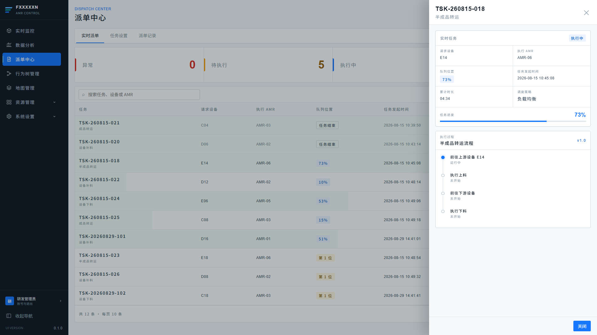

图 4-2　实时任务详情抽屉

点击任一任务行（或键盘 Enter）后，右侧滑出任务详情抽屉：

1. 抽屉头部显示任务编号与任务类型，右上角“×”与底部“关闭”均可关闭抽屉。
2. “实时任务”概览区显示：状态、请求设备、执行 AMR、队列 / 进度、任务发起时间、调度策略、优先级，以及任务进度条与百分比；不展示当前阶段和持续刷新的累计时长。
3. 调度策略按任务类型从“任务设置”中实时读取；该类型无规则时显示默认策略“先进先出”。
4. “执行过程”区显示该任务绑定的行为树名称与版本，以及行为树节点步骤列表；每个步骤呈现“未开始 / 运行中 / 已完成 / 失败”状态、失败原因说明和已完成步骤的耗时。
5. 任务状态为“异常”时，概览区使用异常样式，失败步骤同步标记失败原因（如“限行区通行权申请超时，已重试 3 次”）。
6. 抽屉内容随任务推进持续刷新；任务结束后该详情切换为对应的派单记录详情。

### 4.3 任务设置

| 需求字段 | 内容 |
| --- | --- |
| 用户场景 | 调度员需要按任务类型配置选车策略、默认优先级与 APS，使新任务创建时自动按规则派单。 |
| 功能说明 | 以任务类型为维度的派单规则列表与编辑弹窗。 |
| 输入/前置条件 | 系统已同步任务类型清单；任务类型由系统自动同步，页面不提供新增或删除任务类型。 |
| 输出/后置条件 | 保存后规则立即生效：新任务按新策略选车、按新优先级入队；“修改时间”更新为保存时间。 |
| 补充说明 | 规则变更不影响已在执行或已在队列中的任务，仅作用于保存后创建的新任务。 |

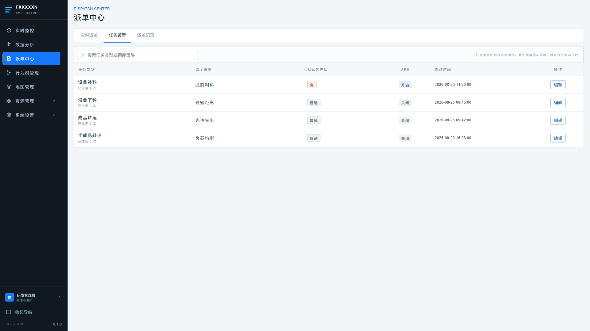

图 4-3　任务设置列表

列表字段：

| 列 | 内容与口径 |
| --- | --- |
| 任务类型 | 任务类型名称，副行显示“已应用 N 次”（按派单记录中该类型的记录数统计）。 |
| 调度策略 | 该类型当前生效的选车策略。 |
| 默认优先级 | 普通 / 高；高优先级带强调样式。 |
| APS | 开启 / 关闭。 |
| 修改时间 | 最近一次保存时间。 |
| 操作 | “编辑”按钮，打开编辑弹窗。 |

列表规则：

1. 顶部关键字搜索覆盖任务类型与调度策略。
2. 表头提示“任务类型由系统自动同步，此处调整选车策略、默认优先级与 APS”。
3. 无符合条件规则时显示空状态“没有符合条件的任务设置”。

#### 编辑任务设置弹窗

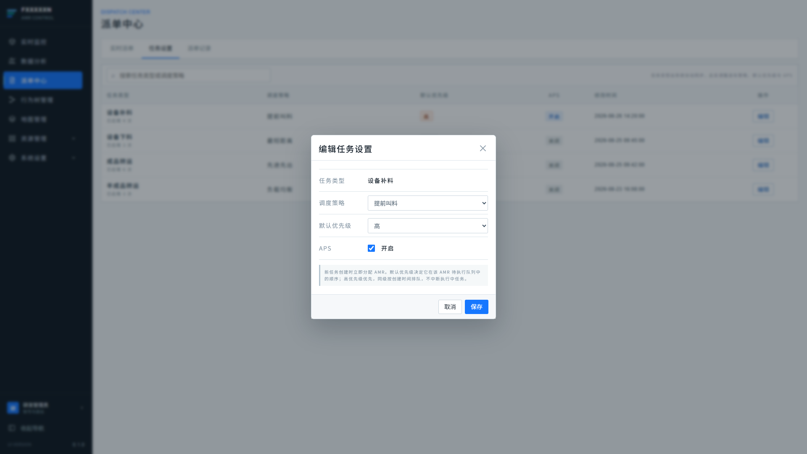

图 4-4　编辑任务设置弹窗

| 弹窗字段 | 可编辑性 | 取值 |
| --- | --- | --- |
| 任务类型 | 只读 | 展示被编辑规则的类型名称。 |
| 调度策略 | 下拉选择 | 先进先出、最短距离、最短时间、提前叫料、负载均衡。 |
| 默认优先级 | 下拉选择 | 普通、高。 |
| APS | 开关 | 开启 / 关闭。 |

1. 弹窗内说明文案：“新任务创建时立即分配 AMR。默认优先级决定它在该 AMR 待执行队列中的顺序；高优先级优先，同级按创建时间排队，不中断执行中任务。”
2. 点击“保存”提交规则；“取消”或“×”关闭弹窗不保存。
3. 保存过程中按钮显示“保存中”并禁用重复提交；保存成功后弹窗关闭，列表与“修改时间”同步更新。

### 4.4 派单记录

| 需求字段 | 内容 |
| --- | --- |
| 用户场景 | 管理员需要按时间与结果回溯历史派单，查看单条任务的完整生命周期与结果摘要。 |
| 功能说明 | 已结束任务的归档列表、筛选分页与记录详情抽屉。 |
| 输入/前置条件 | 历史派单记录已成功载入。 |
| 输出/后置条件 | 用户可查看任务创建至结束的完整过程、耗时与结果摘要。 |
| 补充说明 | 派单记录为只读数据，页面不提供删除或修改。 |

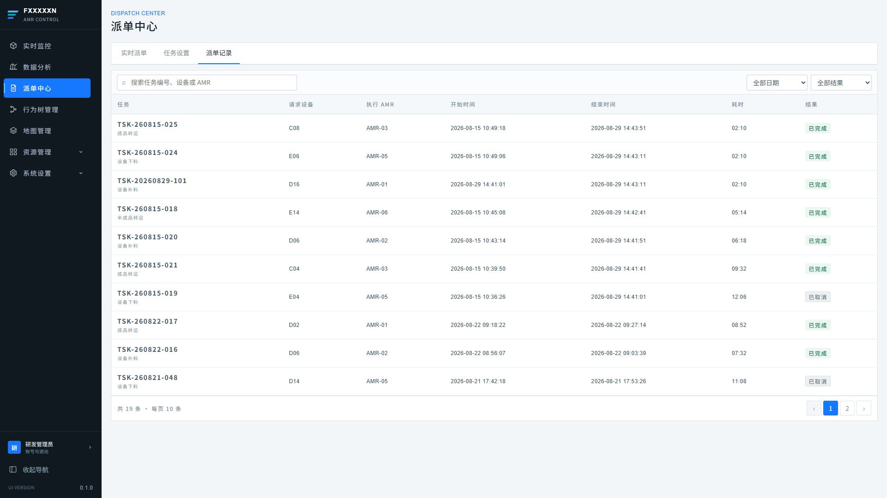

图 4-5　派单记录列表

列表字段：

| 列 | 内容与口径 |
| --- | --- |
| 任务 | 任务编号（主行）与任务类型（副行）。 |
| 请求设备 | 发起该任务的设备编号。 |
| 执行 AMR | 执行该任务的车辆编号。 |
| 开始时间 | 任务创建时间。 |
| 结束时间 | 任务归档（完成或取消）时间。 |
| 耗时 | 任务执行累计时长。 |
| 结果 | 已完成 / 已取消。 |

筛选与分页规则：

1. 关键字搜索覆盖任务编号、请求设备与执行 AMR。
2. 时间筛选取值“今日 / 近 7 天 / 近 30 天 / 全部日期”，按记录结束时间过滤；“今日”为本地时区当日 `00:00:00` 起。
3. 结果筛选取值“全部结果 / 已完成 / 已取消”。
4. 分页固定每页 10 条；任一筛选条件变化后页码重置为第 1 页；无符合条件记录时显示空状态“没有符合条件的派单记录”。

#### 派单记录详情抽屉

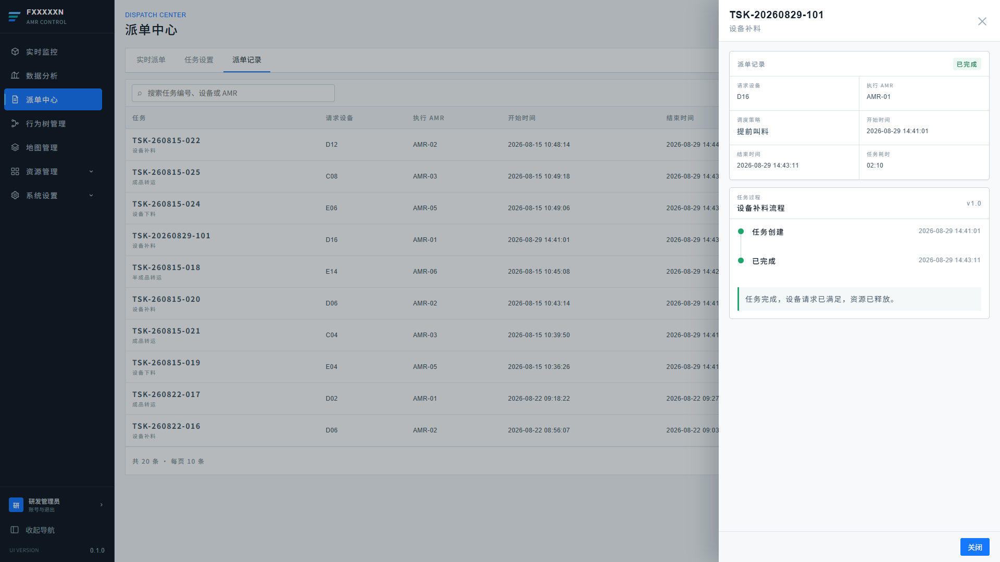

图 4-6　派单记录详情抽屉

1. 点击记录行（或键盘 Enter）打开右侧详情抽屉，头部显示任务编号与类型。
2. “派单记录”概览区显示：结果、请求设备、执行 AMR、调度策略、开始时间、结束时间与任务耗时；调度策略缺失时显示“—”。
3. “任务过程”区以时间线呈现“任务创建 → 已完成 / 已取消”两个节点及对应时间。
4. 结果摘要在时间线下方完整展示（如“任务完成，设备请求已满足，资源已释放。”），已取消记录使用取消样式。

### 4.5 调度与队列规则

| 需求字段 | 内容 |
| --- | --- |
| 用户场景 | 系统需要在无人干预的情况下自动为任务选择车辆并组织执行顺序。 |
| 功能说明 | 定义可选车辆条件、各调度策略的选车口径、待执行队列排序与任务生命周期流转。 |
| 输入/前置条件 | 新任务请求已产生，且该任务类型存在（或默认）的调度策略。 |
| 输出/后置条件 | 任务绑定 AMR 后立即执行或进入待执行队列；任务结束后释放 AMR 并启动下一项。 |
| 补充说明 | 本节为派单中心各页签共用的业务规则，与“任务设置”页签的字段一一对应。 |

#### 选车条件与策略

1. 新任务创建时立即分配 AMR；候选车辆必须同时满足：在线、可运行、未暂停接单、状态不是停用 / 充电 / 异常 / 离线，且服务设备范围包含请求设备。
2. 无可用车辆时任务不落库，等待后续请求重试；不抢占已绑定其他任务的车辆。
3. 各调度策略的选车口径：

| 调度策略 | 选车口径 |
| --- | --- |
| 先进先出 | 按任务到达顺序分配当前工作量最少的可用车辆。 |
| 最短距离 | 选择与请求设备直线距离最近的可用车辆。 |
| 最短时间 | 综合估算 `现有任务数 × 单任务参考时长 + 距离`，选择预计完成时间最早的可用车辆。 |
| 提前叫料 | 依据设备消耗预测提前发起叫料任务；原型中与先进先出同口径选车。 |
| 负载均衡 | 选择当前绑定任务数最少的可用车辆，均衡车队负载。 |

#### 队列与生命周期流转

1. 被绑定车辆空闲时任务立即进入“执行中”；车辆忙碌时任务进入“待执行”队列，同一 AMR 的队列按“高优先级优先，同级按创建时间、编号升序”排序。
2. 新任务不中断执行中任务；当前任务结束后按上述顺序自动启动同车队列的下一项，无后续任务时车辆回到空闲。
3. 任务进度达到 100% 时归档为“已完成”记录：释放 AMR、生成派单记录、从实时列表移除。
4. 任务执行中出现阻断性异常时进入“异常”状态：进度与队列位置保留，行为树当前步骤标记失败与原因；异常任务处理结束后按最终结果归档。
5. 异常任务的重试保持原 AMR 绑定，不重新选车；重试时回退部分进度并重置失败步骤。
6. 原型可将异常任务在 10 秒后自动归档为“已取消”，用于验证状态流转和最近结束展示；该逻辑不是正式业务规则，真实终态由后端任务执行域决定。

> **数据一致性**：实时派单列表、任务详情抽屉、摘要看板与派单记录必须来自同一份任务数据；同一任务编号在实时页签与记录页签呈现的字段（编号、类型、请求设备、执行 AMR）必须一致。

## 5. 行为树管理

### 5.1 行为树列表

| 需求字段 | 内容 |
| --- | --- |
| 用户场景 | 研发与调试人员需要查看系统已发布的任务行为树和可复用子树，确认任务类型、版本与允许执行的 AMR。 |
| 功能说明 | 提供行为树 / 子树分栏列表、关键字搜索、新增、绑定 AMR 与进入编辑器。 |
| 输入/前置条件 | 行为树模板、子树模板和 AMR 资源目录已加载。 |
| 输出/后置条件 | 用户可打开模板编辑器；行为树可保存允许执行的 AMR 范围，子树仅供复用。 |
| 补充说明 | 模板管理与运行中的行为节点轨迹是两个数据域，不得用模板结构替代任务实例执行记录。 |

列表规则：

1. 页面使用“行为树 / 子树”互斥页签，默认进入行为树，不提供混合“全部”页签。
2. 行为树列表展示编号、任务类型、名称、流程摘要、版本、发布状态、更新时间和操作；子树不展示任务类型绑定和 AMR 绑定操作。
3. 搜索覆盖编号、名称、任务类型和流程摘要；空结果显示明确空状态。
4. “绑定”弹窗列出资源管理中的 AMR，允许多选。保存后只影响后续创建的任务实例，不改变执行中的任务。
5. 新增入口只要求选择“行为树 / 子树”并填写名称；任务类型与版本在编辑和发布流程中维护。

首期任务类型与标准行为树：

| 任务类型 | 标准业务节点 |
| --- | --- |
| 设备补料 | 前往备料点 → 执行上料 → 前往目标设备 → 执行下料 |
| 设备下料 | 前往目标设备 → 执行上料 → 前往下料点 → 执行下料 |
| 成品转运 | 前往产出设备 → 执行上料 → 前往成品下料点 → 执行下料 |
| 半成品转运 | 前往上游设备 → 执行上料 → 前往下游设备 → 执行下料 |

1. 上述四步是首期业务骨架，不是固定节点数量限制；后续允许插入校验、等待、条件和业务动作。
2. 限行区、互斥路段等交通资源申请由“前往……”导航节点在运行时处理，通过节点详情与交通事件展示，不新增固定顶层节点。
3. 上料和下料是两个独立动作，可分别封装为“标准上料单元”和“标准下料单元”子树。

### 5.2 行为树编辑

| 需求字段 | 内容 |
| --- | --- |
| 用户场景 | 研发人员需要以图形方式组合节点、配置失败策略并在发布前检查结构。 |
| 功能说明 | 提供节点库、画布和属性面板三栏编辑工作台，支持新增节点、移动、连接、删除、校验、保存草稿和发布。 |
| 输入/前置条件 | 用户从行为树或子树列表进入编辑器，具有对应编辑权限。 |
| 输出/后置条件 | 合法结构可保存并发布为新版本；非法结构只能保存草稿。 |
| 补充说明 | 行为树节点 ID 是稳定标识，节点名称可修改；历史任务继续引用执行时的模板版本。 |

编辑器要求：

1. 左侧节点库分为基础节点与已发布子树。基础节点至少包含序列、选择、条件、前往目标、执行上料和执行下料。
2. 中央画布支持拖放、选中、连线、平移与缩放；连接关系必须形成单一入口且不得存在悬空节点或循环引用。
3. 右侧属性面板按节点类型显示名称、目标对象、超时时间、失败策略、重试次数和输入参数；不适用字段不得提交。
4. 删除存在下游连接的节点时必须提示影响范围；删除子树引用不删除子树模板本身。
5. 结构校验至少覆盖：缺少根节点、多个根节点、悬空节点、非法循环、缺少目标、引用未发布子树及版本不兼容。
6. 发布生成不可变版本；后续修改从新草稿开始。执行中的任务固定使用创建时的版本，不热切换。
7. 首页与任务详情只读取扁平化执行轨迹（未开始、运行中、已完成、失败等），不加载完整编辑器数据。

## 6. 资源管理

### 6.1 AMR 列表与详情

| 需求字段 | 内容 |
| --- | --- |
| 用户场景 | 设备管理员需要维护车辆主数据并核对车辆与服务站点的关系。 |
| 功能说明 | 提供 AMR 列表、搜索筛选和只读详情，区分主数据、连接状态与调度能力。 |
| 输入/前置条件 | AMR 主数据与实时状态快照可用。 |
| 输出/后置条件 | 用户可定位指定车辆，查看型号、网络、服务范围和当前运行状态。 |
| 补充说明 | 位置、电量和状态属于高频运行数据，不得覆盖名称、型号和服务范围等主数据。 |

AMR 列表至少展示车辆编号、名称、型号、IP、连接状态、运行状态、电量和当前位置，并支持按关键字、连接状态与运行状态筛选。详情分为：

1. 基本资料：车辆编号、名称、IP、型号、底盘类型、额定载荷、初始点位。
2. 运行资料：连接状态、是否可运行、调度状态、当前任务、速度、电量、当前位置、最近连接时间。
3. 服务范围：完整标定站点与当前可自动服务站点。人工上料站点保留在完整范围中但置灰，不参与自动选车。
4. 关系联动：点击服务站点可进入设备详情；从地图或任务选择 AMR 时使用同一 `amrId` 关联。
5. 异常和离线状态下不得被新任务选中；已绑定任务的处置由后端任务执行域决定。

### 6.2 设备列表与详情

| 需求字段 | 内容 |
| --- | --- |
| 用户场景 | 设备管理员需要确认站点、现场设备、地图点位与服务车辆之间的关系。 |
| 功能说明 | 提供设备 / 站点列表及详情，显示连接、启用、地图和服务 AMR 信息。 |
| 输入/前置条件 | 资源目录与当前地图版本已加载。 |
| 输出/后置条件 | 用户可确认设备是否可用于派单，以及由哪些车辆提供自动服务。 |
| 补充说明 | 资源详情为配置视图，实时任务和交通占用仍在实时监控查看。 |

1. 设备列表展示编号、名称、类型、所属产线、启用状态、连接状态、绑定点位和资源状态。
2. 详情展示资源主数据、地图坐标、绑定点位、当前地图版本和反向关联的服务 AMR。
3. 请求设备只有在启用、连接正常且被至少一台可用 AMR 覆盖时才可进入自动派单候选流程；无候选车辆时后端返回明确原因。
4. 当前演示范围包含 D、C、E 三条线，每条线 12 个一拖二机械手臂站点，编号为 D02～D24、C02～C24、E02～E24。
5. E08、E10 为人工上料位置，不进入 AMR-05、AMR-06 的自动服务集合，但仍保留在车辆完整标定范围中。

## 7. 地图管理

### 7.1 地图版本

| 需求字段 | 内容 |
| --- | --- |
| 用户场景 | 地图管理员需要浏览同一运行范围内由不同车辆上传的多个地图版本，选择版本进入编辑，或将已发布版本切换为全局运行地图。 |
| 功能说明 | 以卡片库呈现地图版本清单，提供搜索筛选、进入编辑器、设置当前地图与导入新版本。 |
| 输入/前置条件 | 用户已进入“地图管理”页面；系统已取得当前运行范围的地图目录。 |
| 输出/后置条件 | 点击卡片进入对应地图的编辑器；切换当前地图后全局系统使用新版本；导入后生成一张草稿状态的新地图卡片。 |
| 补充说明 | 同一时间同一运行范围仅允许一张地图为“当前地图”，与实时监控的全局逻辑地图保持一致。 |

#### 7.1.1 地图卡片库与筛选

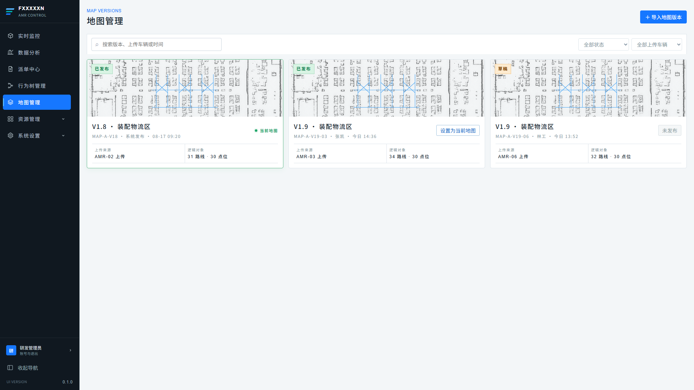

图 7-1　地图版本卡片库

1. 标题区显示“MAP VERSIONS”和“地图管理”，右上角提供“＋ 导入地图版本”入口。
2. 工具栏提供关键字搜索（覆盖地图编号、版本号、上传车辆与更新时间）、状态筛选（全部状态 / 已发布 / 草稿 / 空白）与上传车辆筛选（全部上传车辆 / 各车辆）。
3. 每张卡片包含：

| 卡片区域 | 内容 |
| --- | --- |
| 预览图 | 点云底图与路网示意图；“空白”状态卡片不显示预览图。 |
| 状态角标 | 已发布 / 草稿 / 空白。 |
| 标题行 | `版本号 · 地图名称`，副行显示 `地图编号 · 负责人 · 更新时间`。 |
| 当前地图标记 | 当前运行地图显示“当前地图”标签；其余已发布地图显示“设置为当前地图”按钮，未发布地图该按钮禁用并显示“未发布”。 |
| 摘要信息 | 上传来源、逻辑对象（路线数 · 点位数）。 |

4. 鼠标悬停卡片时预览区显示“打开地图编辑器 ↗”；点击卡片任意位置（含 Enter 键）进入该地图的编辑器。
5. 无符合条件地图时卡片库为空，不显示占位卡片。

#### 7.1.2 设置为当前地图

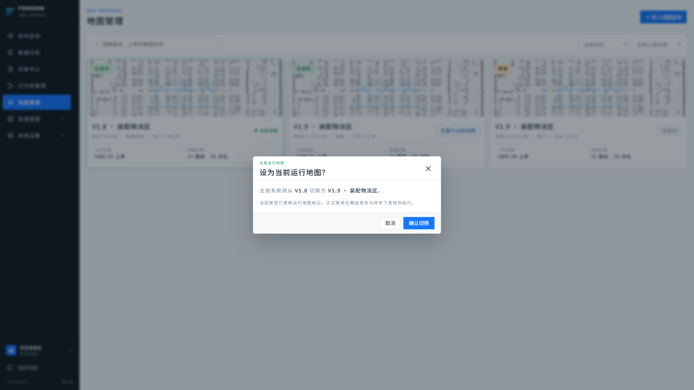

图 7-2　设置为当前运行地图确认弹窗

1. 仅“已发布”状态且非当前的地图可触发“设置为当前地图”；草稿与空白地图按钮禁用，并提示“地图发布后才能设为当前运行地图”。
2. 点击后弹出确认弹窗“设为当前运行地图？”，正文展示切换前后版本：“全局系统将从 `当前版本` 切换为 `目标版本 · 地图名称`。”
3. 点击“确认切换”后，目标地图标记为当前地图，原当前地图解除标记；点击“取消”或“×”放弃切换。
4. 切换为全局操作，影响实时监控、派单中心等所有使用逻辑地图的模块；正式版本需按发布与异步下发规则执行切换。

#### 7.1.3 导入地图版本

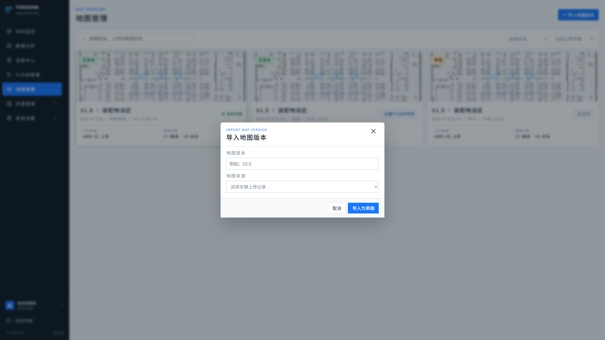

图 7-3　导入地图版本弹窗

1. 点击“＋ 导入地图版本”打开导入弹窗“导入地图版本”。
2. 弹窗字段：

| 弹窗字段 | 类型 | 说明 |
| --- | --- | --- |
| 地图版本 | 文本输入 | 新版本的版本号，例如 `V2.0`。 |
| 地图来源 | 下拉选择 | 车辆上传记录（如“AMR-03 · 今日 14:36”）或“本地文件导入”。 |

3. 点击“导入为草稿”后，以草稿状态生成新的地图卡片并进入地图目录；“取消”或“×”关闭弹窗不导入。
4. 导入的草稿需先在地图编辑器中完成编辑并发布，才能被设置为当前运行地图。

### 7.2 地图编辑器

| 需求字段 | 内容 |
| --- | --- |
| 用户场景 | 地图管理员需要在上传的点云底图上维护导航站点、路线与管制区，并将编辑结果保存为草稿或发布生效。 |
| 功能说明 | 提供画布、工具栏、属性面板三区式编辑工作台，支持站点 / 路线 / 管制区的新增、属性编辑、删除、撤销、保存草稿与发布。 |
| 输入/前置条件 | 用户已从地图卡片库进入某地图的编辑器；系统已取得该地图草稿与资源目录（设备清单）。 |
| 输出/后置条件 | 编辑内容以草稿形式保存；发布后地图进入“已发布”状态，可在地图版本页设置为当前运行地图。 |
| 补充说明 | 编辑器仅作用于草稿；已发布版本的运行数据不受未发布编辑影响。 |

#### 7.2.1 整体布局与视图操作

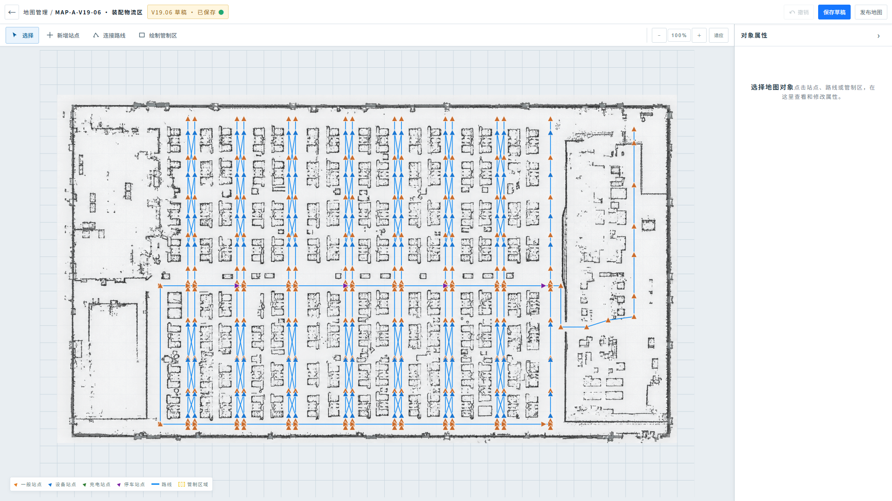

图 7-4　地图编辑器整体布局

页面由四个区域组成：

| 区域 | 内容 |
| --- | --- |
| 顶栏 | 返回按钮、面包屑“地图管理 / 地图编号 · 地图名称”、草稿状态提示（“版本号 草稿 · 已保存 / 未保存”或操作通知），以及“撤销”“保存草稿”“发布地图”按钮。 |
| 左侧工具栏 | “选择”“新增站点”“连接路线”“绘制管制区”四个工具按钮与缩放控件（− / 当前缩放比 / ＋ / 适应）。 |
| 中央画布 | 点云底图 + 网格背景 + 管制区 / 基础路网 / 路线 / 站点图层，画布底部显示图例。 |
| 右侧属性面板 | 选择工具下显示所选对象属性；其他工具下显示该工具的操作面板；可折叠。 |

视图操作规则：

1. 滚轮缩放以鼠标位置为中心，缩放范围 60%—400%；“＋ / −”按钮每次步进 20%，“适应”恢复 100%。
2. 选择工具下按住左键拖动空白处平移画布；缩放比例达到 170% 及以上时显示点位编号，选中对象的编号始终显示。
3. 画布图例标明一般站点、设备站点、充电站点、停车站点、路线与管制区域；被管制区覆盖的站点与路线使用覆盖态样式。
4. 选择非“选择”工具时，左侧工具栏下方显示当前工具名称与操作提示（如“依次选择起点与终点，建立站点之间的直线路线”），按 `Esc` 可随时切回选择工具。

#### 7.2.2 站点管理

新增站点：

1. 选择“新增站点”工具后，点击画布任意位置创建站点；站点编号按 `P-01`、`P-02` 顺序自动生成。
2. 创建成功后自动选中该站点并切回选择工具，右侧面板进入站点属性编辑。

站点属性面板：

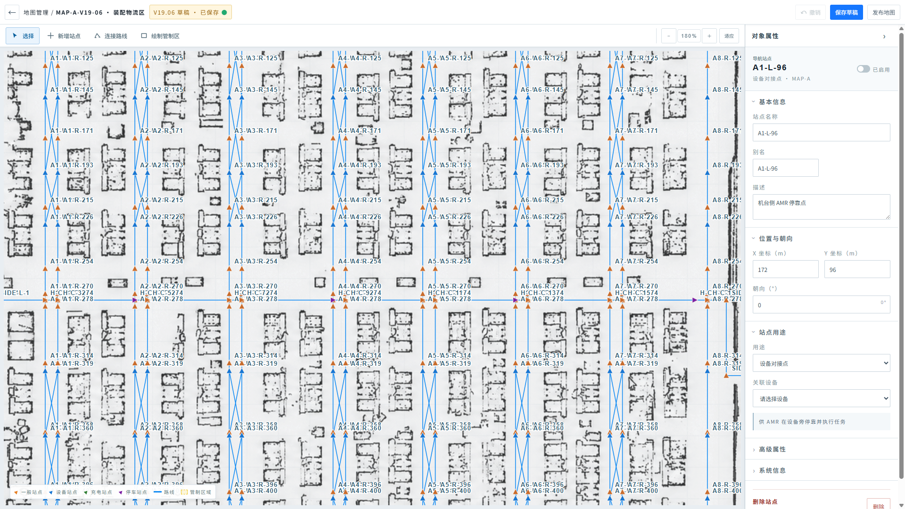

图 7-5　站点属性面板

| 属性分组 | 字段 | 说明 |
| --- | --- | --- |
| 头部 | 名称、用途标签、所属地图、启用开关 | 启用 / 禁用切换即时生效并标记草稿未保存。 |
| 基本信息 | 站点名称、别名、描述 | 描述可选，用于说明现场位置。 |
| 位置与朝向 | X 坐标（m）、Y 坐标（m）、朝向（°） | 坐标精确到 0.0001 m，朝向以角度输入并换算存储。 |
| 站点用途 | 用途、关联设备 | 用途分四类；选择设备对接点或充电点后须关联设备。 |
| 高级属性 | 可选取、可重新定位、狭窄点、分离点 | 控制调度系统与车端导航行为。 |
| 系统信息 | 站点 UID、所属地图、前置站点、Pose Type | UID、所属地图与 Pose Type 只读。 |
| 危险操作 | 删除站点 | 弹确认框，删除时级联删除连接路线。 |

站点用途规则：

| 用途 | 说明 | 可关联设备 |
| --- | --- | --- |
| 普通导航点 | 仅用于导航和路网连接。 | 无。 |
| 设备对接点 | 供 AMR 在设备旁停靠并执行任务。 | 机床 / 缓存 / 回收类设备。 |
| 充电点 | 供 AMR 到达充电设备进行充电。 | 充电类设备。 |
| Home / 停车点 | 供 AMR 待命或返回 Home。 | 无。 |

1. 切换站点用途时清空已关联设备，并同步站点的充电、停车、对接标记与 `poseType`（对接点为 `DOCK`，其余为 `NORMAL`）。
2. 关联设备下拉仅列出与用途匹配的设备类型；无匹配设备时显示“暂无可关联设备”。
3. 对应用途的站点在画布上使用设备站点、充电站点、停车站点专属样式，与图例一致。

删除站点：

1. 点击“删除站点”后弹出危险操作确认框，标题为“删除站点 {编号}？”。
2. 描述明确级联影响：“将同时删除连接该站点的 N 条路线。此操作无法撤销。”
3. 确认删除后站点与其全部连接路线同时移除；取消则不改动。

#### 7.2.3 路线管理

连接路线工具：

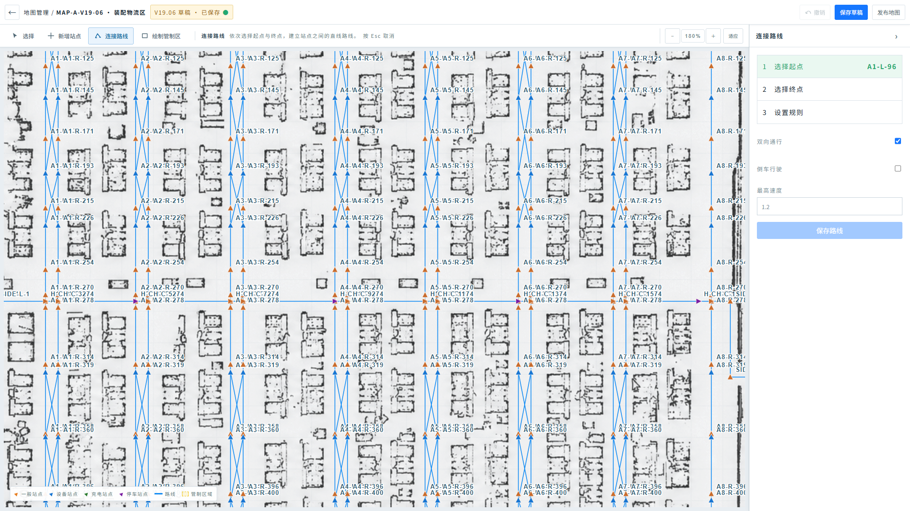

图 7-6　连接路线工具操作面板

1. 选择“连接路线”工具后，右侧面板显示三步流程：① 选择起点、② 选择终点、③ 设置规则，已完成的步骤实时回显所选站点编号。
2. 依次点击两个站点完成起终点选择；起点与终点不能为同一站点。
3. 规则设置包括：双向通行（默认开启）、倒车行驶（默认关闭）、最高速度（m/s）。
4. 点击“保存路线”创建路线，编号按 `R-001`、`R-002` 顺序生成，规划类型固定为 `STRAIGHT_LINE`（直线路线）；保存后自动选中并切回选择工具。

路线属性面板：

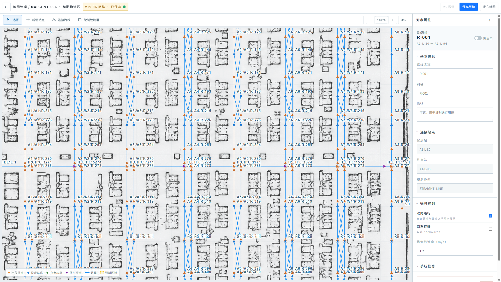

图 7-7　路线属性面板

| 属性分组 | 字段 | 说明 |
| --- | --- | --- |
| 头部 | 路线名称、起终点（`起点 → 终点`）、启用开关 | 展示直线路线标识与连接方向。 |
| 基本信息 | 路线名称、别名、描述 | 描述可选，用于说明通行用途。 |
| 连接站点 | 起点站、终点站、规划类型 | 均为只读；路线方向由创建时的选择顺序决定。 |
| 通行规则 | 双向通行、倒车行驶、最大线速度（m/s） | 双向通行允许起点与终点之间双向导航；倒车行驶为车端行为标记。 |
| 系统信息 | 路线编号、所属地图 | 只读。 |
| 危险操作 | 删除路线 | 弹确认框，仅删除该连接。 |

1. 删除路线的确认描述为“将删除这两个站点之间的当前连接。此操作无法撤销。”
2. 禁用路线在画布上显示禁用样式，但保留在草稿中，可随时重新启用。

#### 7.2.4 管制区管理

绘制管制区工具：

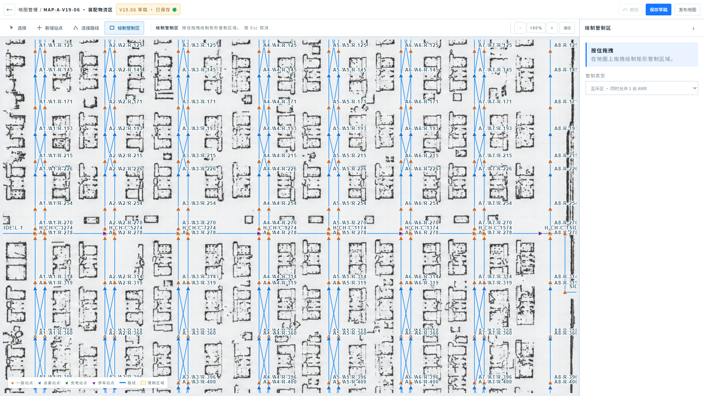

图 7-8　绘制管制区工具操作面板

1. 选择“绘制管制区”工具后，右侧面板提供管制类型选择与限速值设置（仅限速区显示）。
2. 在画布上按住左键拖拽绘制矩形区域；宽或高不足最小尺寸（5 m）时取消并提示“区域太小，已取消”。
3. 创建成功后编号按 `ZONE-01`、`ZONE-02` 顺序生成，自动选中并切回选择工具。

管制区类型规则：

| 管制类型 | 规则 |
| --- | --- |
| 互斥区 | 同一时间只允许 1 台 AMR 进入。 |
| 限速区 | 限制 AMR 在区域内的行驶速度，需配置限速值（m/s）。 |
| 禁行区 | 禁止任何 AMR 进入该区域、路线不得穿越。 |

管制区属性面板：

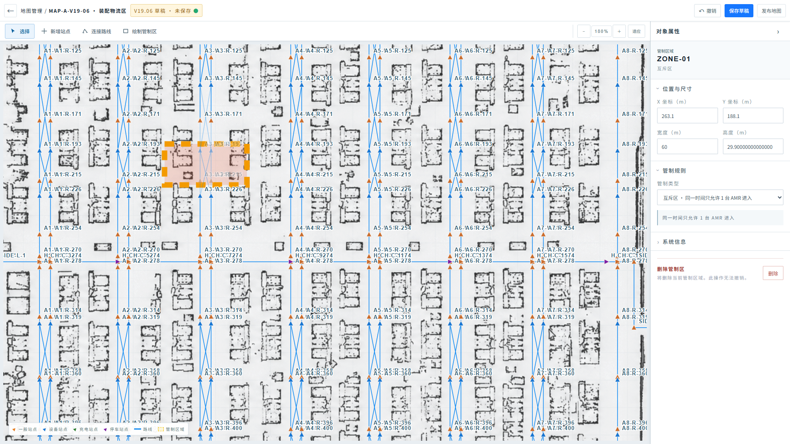

图 7-9　管制区属性面板

| 属性分组 | 字段 | 说明 |
| --- | --- | --- |
| 头部 | 区域编号、管制类型标签 | 展示当前管制规则类别。 |
| 位置与尺寸 | X 坐标（m）、Y 坐标（m）、宽度（m）、高度（m） | 数值可精确调整，最小 0.1。 |
| 管制规则 | 管制类型、限速值（仅限速区） | 切换类型即时生效；限速区下方回显当前限速。 |
| 系统信息 | 区域编号 | 只读。 |
| 危险操作 | 删除管制区 | 弹确认框。 |

1. 删除管制区的确认描述为“将删除当前管制区域。此操作无法撤销。”
2. 编辑器实时计算被管制区覆盖的站点与穿越的路线，并在画布上以覆盖态标示，用于评估管制影响范围。

#### 7.2.5 草稿保存、撤销与发布

草稿状态与保存：

1. 顶栏状态提示随编辑动作切换：“`版本号` 草稿 · 未保存” / “已保存”；任何属性或对象修改都会将状态置为未保存。
2. 点击“保存草稿”提交当前草稿，保存期间按钮显示“保存中…”；成功后提示“草稿已保存”。
3. 顶栏还以通知形式反馈最近一次操作结果（如“对象已删除”“管制区已创建”“已撤销上一步操作”）。

撤销：

1. 支持工具栏“撤销”按钮与快捷键 `Ctrl / Cmd + Z`，撤销上限 30 步。
2. 新建对象、删除对象与属性修改（进入输入编辑时）均先写入历史栈；撤销后草稿标记为未保存。

发布：

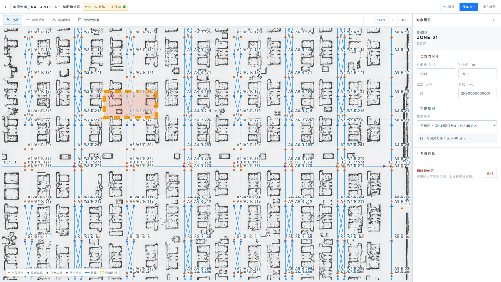

图 7-10　发布确认弹窗（截图待补充）

1. 点击“发布地图”时，若存在未保存改动先自动保存草稿，再弹出发布确认弹窗“确定要发布当前地图吗？”。
2. 弹窗正文提示：“发布后地图将以最新草稿生效。请确认所有改动已保存完毕。”并以警示样式强调“发布操作不可撤销，如需回退请基于已发布版本重新编辑。”
3. 点击“确认发布”后地图以最新草稿发布，页面提示“地图已发布”；发布成功后可在“地图版本”页将该地图设置为当前运行地图。
4. 点击“取消”或“×”关闭弹窗，草稿保持原状。

> **模块联动**：地图编辑器发布的版本是“地图版本”页设置当前地图的前提；切换当前地图后，实时监控的全局逻辑地图、AMR 服务关系与派单选车所用的资源位置均以新版本为准。

## 8. 系统设置

### 8.1 用户管理

| 需求字段 | 内容 |
| --- | --- |
| 用户场景 | 系统管理员需要维护可登录账号、人员身份、角色和启用状态。 |
| 功能说明 | 提供用户列表、搜索筛选、新增与编辑，不直接分配细粒度权限。 |
| 输入/前置条件 | 当前用户具有系统管理权限。 |
| 输出/后置条件 | 用户资料保存后立即反映在列表；禁用账号无法新建会话。 |
| 补充说明 | 用户名是稳定账号标识，创建后不可修改；禁止删除仍有关联审计记录的用户。 |

1. 列表展示用户名、姓名、角色、状态、最近登录时间与更新时间；支持按用户名 / 姓名搜索，并按角色、启用状态筛选。
2. 新增字段包括用户名、姓名、角色、初始密码和启用状态；用户名必填且唯一。
3. 编辑允许修改姓名、角色和启用状态；重置密码使用独立受控操作并记录操作日志。
4. 禁用当前登录账号或最后一名系统管理员时必须阻止并提示原因。
5. 保存失败时保留输入内容，展示后端业务错误；不得用前端成功提示掩盖实际失败。

### 8.2 角色权限

系统采用固定角色，首期不提供任意新建角色或权限转授：

| 角色 | 查看范围 | 允许操作 |
| --- | --- | --- |
| 现场人员 | 实时监控、任务、资源与告警 | 查看、筛选、定位；不维护系统配置。 |
| 研发人员 | 现场人员范围 + 行为树与地图编辑 | 保存草稿、结构校验、发布前验证；发布权限可独立控制。 |
| 系统管理员 | 全部模块 | 用户、角色映射、字典、日志和发布类操作。 |
| 只读用户 | 被授权的查询页面 | 仅查看、搜索和筛选。 |

1. 前端菜单、按钮和路由守卫使用同一权限标识；后端必须再次鉴权，不能只依赖隐藏按钮。
2. 暂停 / 恢复任务、车辆直接控制、地图发布等高风险能力必须使用独立权限并记录审计；系统不支持用户取消任务。
3. 权限变更对新请求立即生效；现有会话是否强制刷新由认证服务策略决定。

### 8.3 数据字典

1. 字典按分类展示编码、名称、显示顺序、启用状态、说明和更新时间，支持分类筛选与关键字搜索。
2. 业务可配置字典允许新增和编辑；系统运行状态、任务状态等核心字典为系统维护，不允许直接删除或修改编码。
3. 已被历史数据引用的字典项只能停用，不能物理删除；停用后历史页面仍显示原名称，新建数据不得继续选择。
4. 编码在同一分类内唯一，保存时由后端校验并返回冲突项。

### 8.4 操作日志与系统日志

操作日志：

1. 记录用户、模块、操作、对象类型、对象编号、操作结果、说明、时间、来源 IP 与 Trace ID。
2. 支持按用户、模块、结果、时间范围和关键字筛选；日志只读，不提供编辑或删除。
3. 高风险操作应记录操作前后关键字段，敏感值按安全规则脱敏。

系统日志：

1. 记录级别、服务、AMR、任务、Trace ID、日志摘要和发生时间；支持按级别、服务、AMR、任务与关键字筛选。
2. 详情展示完整摘要、上下文标识和可复制 Trace ID，便于跨服务排障；页面不得直接暴露密钥、令牌或完整密码。
3. 列表使用服务端分页；大文本详情按需加载，不在首次请求返回全部堆栈。

## 9. 共通数据与接口规则

### 9.1 任务状态与关键字段

| 对象 | 必要字段与约束 |
| --- | --- |
| 实时任务 | `id`、`type`、`amrId`、`requestDeviceId`、`status`、`priority`、`createdAt`、`progress`、行为树名称 / 版本。 |
| 实时状态 | 仅允许待执行、执行中、异常；不存在待分配。 |
| 归档记录 | 结果仅允许已完成、已取消；`requestedAt` 必须继承实时任务 `createdAt`。 |
| 调度规则 | 任务类型、策略、默认优先级（高 / 普通）、APS 开关和更新时间。 |
| 行为节点 | 节点 ID、名称、类型、状态、开始 / 结束时间、失败原因及关联交通事件。 |

1. 实体关系使用 `taskId`、`amrId`、`behaviorInstanceId`、`resourceId` 和 `mapId`，不得依赖显示名称关联。
2. 首次进入或断线重连先获取完整快照，再订阅增量事件；增量事件携带序列号或版本，前端拒绝重复与乱序更新。
3. 任务状态、整体进度和队列顺位只在实际变化时推送；实时列表不为累计时长建立秒级全表刷新。
4. 前端页面不得直接读取 Mock；真实接口与 Mock 通过统一领域 API 返回相同结构。

### 9.2 错误、空状态与断线

1. 首次加载显示骨架或明确加载态；局部接口失败仅影响对应区域，并提供重试入口。
2. 无任务、无记录、无地图或无筛选结果使用不同空状态文案，不能统一显示“暂无数据”。
3. 实时连接断开时保留最后快照并标记数据时间，自动指数退避重连；重连成功后重新获取快照再恢复增量订阅。
4. 401 跳转登录，403 显示无权限，业务错误显示可理解原因，网络错误显示重试；所有错误保留 Trace ID 供排查。

## 10. 非功能与验收要求

### 10.1 性能与可用性

1. 1920 × 1080 为主要值守分辨率，同时兼容常见办公显示器；任务详情抽屉在窄屏下不得溢出。
2. AMR 位置可采用 200～1000 ms 高频增量；任务、行为、交通和告警采用状态事件，不与地图高频更新绑定重渲染。
3. 列表默认每页 10 条；历史大数据使用服务端筛选与分页，不一次下载整月原始事件。
4. 地图和行为树大型结构按需加载；切换运行范围时取消旧订阅并清理旧选择，避免跨地图残留。
5. 所有可点击行支持键盘 Enter，按钮具有可辨识名称，状态不能只依赖颜色表达。

### 10.2 产品验收

1. 任务创建时立即绑定 AMR，忙碌车辆的新任务进入该车待执行队列，不出现待分配状态。
2. 实时列表展示队列 / 进度、任务发起时间与状态，不展示当前阶段、累计时长或用户取消入口。
3. 同车队列满足高优先级优先、同级按创建时间排序，不中断执行中任务；当前任务结束后自动启动队首任务。
4. 完成或取消任务立即退出当前任务统计并进入派单记录，同时在实时列表原排序位置保留 30 秒。
5. 已完成、已取消和异常分别使用淡绿、淡灰和淡红背景；执行中行保持中性，进度只在字段与详情展示。
6. 四类任务可匹配对应行为树；交通资源申请在导航节点内部表达，节点数量可扩展。
7. 地图版本只有已发布状态才能设置为当前地图；发布前必须完成结构校验与草稿保存。
8. 用户、字典和日志操作符合权限、审计与不可删除历史引用的规则。

### 10.3 技术验收

1. Vue 组件只调用领域 API 或 Store action，不直接依赖请求库或 Mock 文件。
2. TypeScript 类型检查与正式构建通过；核心调度、排序、状态归档和筛选逻辑具备自动化测试。
3. AMR 主数据与高频运行数据分开缓存；增量事件具备去重、排序和断线恢复能力。
4. 任务创建时间、归档开始时间和最终耗时口径一致，跨实时 / 历史页签字段可追溯。
5. 所有高风险操作由后端鉴权并产生操作日志；日志和错误响应包含 Trace ID。

## 11. 参考资料

- 原型展示：<https://zhanzhikai611-del.github.io/AMR_V2/>
- 原型代码仓库：<https://github.com/zhanzhikai611-del/AMR_V2>
- 项目需求说明：`AMR_V2/Doc/需求说明.md`
- 项目技术架构：`AMR_V2/Doc/技术架构.md`
- 格式参考：`FT Cloud V3.17.10需求文档.docx`（僅參考章節組織、表格字段及截圖表達方式）。
